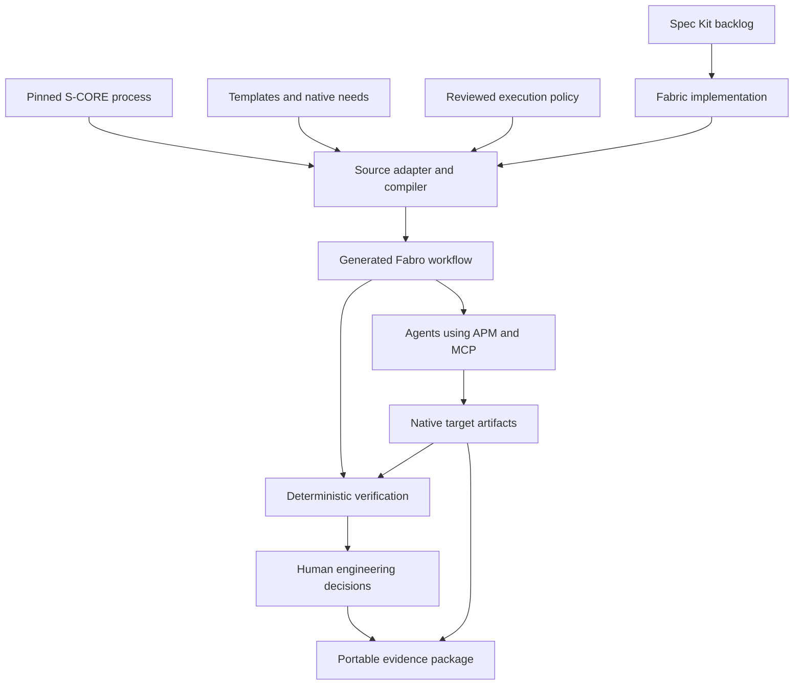
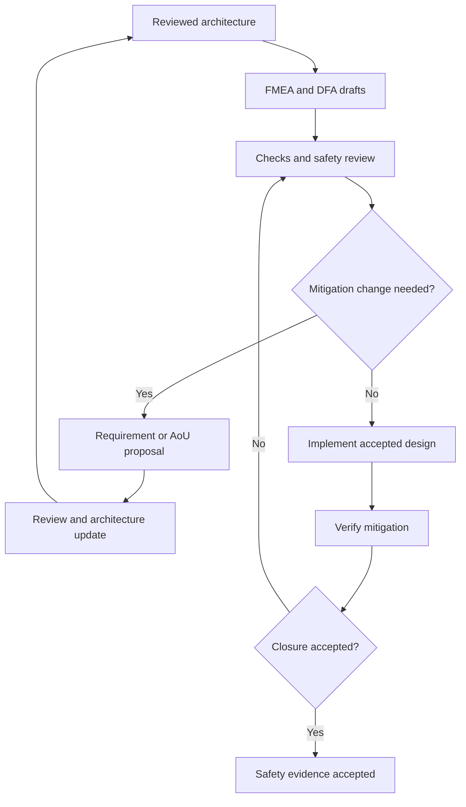
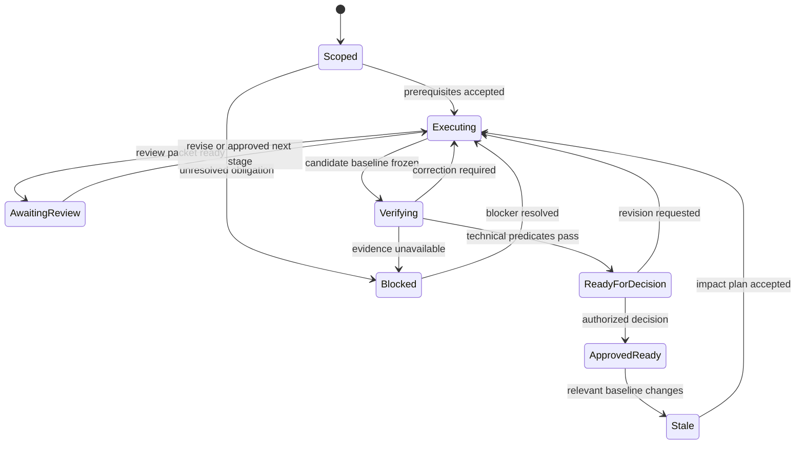

# s-core_sw_fabric — Comprehensive Spec Kit Implementation Brief

**Document version:** 1.0  
**Prepared:** 2026-09-27  
**Implementation target:** independent repository `s-core_sw_fabric`  
**Audience:** Codex, implementation agents, software architects, safety/security engineers, reviewers, and potential Eclipse S-CORE contributors  
**Status:** implementation instructions and acceptance contract; no implementation or certification is claimed by this document.

### Navigation

- [Mission and instructions](#1-mission-and-instructions-to-the-implementing-agent)
- [Decisions and release scope](#2-decisions-carried-forward-and-clarified)
- [Sources and discovery](#3-source-authority-discovery-and-reproducible-baselines)
- [Spec Kit and backlog control](#4-spec-kit-development-and-backlog-control)
- [Repository organization](#5-repository-organization)
- [Architecture](#6-architecture-and-ownership)
- [Process import and compilation](#7-native-process-import-and-workflow-compilation)
- [Intake and lifecycle](#8-target-intake-applicability-and-lifecycle)
- [Work-product catalogue](#9-work-product-catalogue-and-release-obligations)
- [Native artifacts and traceability](#10-native-artifact-generation-and-traceability)
- [FMEA, DFA, and mitigation](#11-safety-engineering-fmea-dfa-mitigation-and-re-analysis)
- [Verification and MISRA](#12-verification-c-quality-and-misra)
- [Security and governance](#13-security-engineering-and-supporting-governance)
- [Human gates and readiness](#14-gates-approvals-and-release-readiness-assessment)
- [Agents, APM/MCP, and costs](#15-agent-roles-apmmcp-integration-and-cost-control)
- [Evidence and recovery](#16-evidence-provenance-resumability-and-trust)
- [CLI and data contracts](#17-proposed-cli-and-data-contracts)
- [Demonstrations](#18-demonstrations-and-acceptance-scenarios)
- [Tests and CI](#19-test-strategy-and-ci)
- [19-increment roadmap](#20-dependency-ordered-spec-kit-backlog)
- [64 fabric requirements](#21-stable-fabric-requirements-and-acceptance-mapping)
- [Constitution and ADRs](#22-constitution-and-architecture-decisions)
- [Upstream strategy](#23-upstream-contribution-strategy-and-non-goals)
- [Definition of done](#24-definition-of-done-and-required-final-report)
- [Starting prompt for Codex](#25-copy-ready-starting-instruction-for-codex)
- [Sources and verification status](#26-sources-verification-status-and-implementation-time-revalidation)

## 1. Mission and instructions to the implementing agent

Build `s-core_sw_fabric`: a Fabro-based engineering workflow integration for Eclipse S-CORE. It shall orchestrate engineering work from an accepted feature/change request through requirements, architecture, safety/security analysis, implementation, verification, and evidence-based release-readiness assessment.

Use **GitHub Spec Kit to develop this repository and control its incremental backlog**. Use **S-CORE's native process, templates, identifiers, relationships, and review rules for the engineering work performed by the fabric**. Use **Fabro as the workflow execution platform**.

The principal question to demonstrate is:

> Can Fabro execute the selected S-CORE engineering process, including analysis feedback loops, traceability, deterministic checks, and accountable human decisions, while preserving native S-CORE artifacts?

The final design invariant is:

> **If Fabro disappeared tomorrow, all authoritative S-CORE engineering artifacts would remain valid and understandable.**

“Valid” in that invariant means that an artifact's engineering meaning, provenance, review history, and justified status survive; it does not turn incomplete or unapproved artifacts into accepted ones.

### 1.1 Expected repository description

> Fabro-based orchestration for Eclipse S-CORE engineering workflows, with native traceability, safety analysis, human approval gates, and deterministic verification.

### 1.2 What to deliver

Implement an independently installable integration package, a source-grounded process adapter and workflow compiler, native artifact handling, evidence and gate evaluators, Fabro integration, and reproducible demonstrations. Provide the complete backlog described below and implement it incrementally in dependency order.

An initial component demonstration is the first vertical slice. The complete target also includes feature, module, security, and platform integration readiness. Do not present the first slice as completion of the full roadmap.

### 1.3 Binding execution rules

1. Inspect the implementation repository and relevant upstream sources before designing adapters.
2. Read applicable `AGENTS.md`, contribution instructions, licenses, build definitions, and version locks.
3. Preserve existing user work. Work on isolated implementation branches/worktrees as appropriate.
4. Treat reference clones as read-only. Perform builds that write files in disposable checkouts or configured build directories.
5. Record resolved versions and capabilities before relying on them.
6. Implement working integrations. Do not substitute diagrams, canned transcripts, or fictional tool output for executable behavior.
7. Keep fixture/replay evidence distinct from evidence obtained by real tools and people.
8. Continue through routine reversible implementation work. Ask only for decisions that genuinely require the owner or an accountable process role.
9. Do not auto-approve engineering gates, edit policies to make a failed run pass, or conceal unavailable tools.
10. Produce exact commands and actual results at each completed milestone.

## 2. Decisions carried forward and clarified

| Topic | Decision |
| --- | --- |
| Repository | `s-core_sw_fabric`, independent of `x-verse_fabric` |
| S-CORE | Authority for the selected engineering process and native work products |
| Fabro | Sole workflow/run-state execution platform; reuse its scheduling, checkpoints, events, loops, and human interactions |
| Spec Kit | Required for the fabric's own specifications, plans, tasks, and backlog control |
| APM/MCP | Reuse S-CORE agent-context packages and tool interfaces where supported; do not replace them with a parallel context platform |
| Sphinx-Needs | Preserve native identifiers, directives, links, validation, and documentation builds |
| Safety | Feature and component FMEA/DFA, mitigation feedback, change impact, verification, and human acceptance |
| Verification | Include detailed design, unit verification, static analysis, code inspection, component/feature integration, and consolidated reports |
| C++ | Default target profile: C++17 with MISRA C++:2023, following the pinned S-CORE policy |
| Static analysis | Reuse `score_cpp_policies`, Clang-Tidy/compiler diagnostics, and the CodeQL coding-standards integration where applicable |
| Deviations | Explicit, scoped, evidence-linked records with authorized human decisions |
| Release objective | Evidence sufficient for a defined S-CORE release scope; readiness is distinct from publishing or downstream vehicle deployment |
| Models | Configurable role/model/reasoning profiles; DeepSeek for routine engineering stages, Codex for deliberate supervision/review |
| Night runs | Fabro progresses autonomously until a budget, failure, or human gate requires stopping; no continuous Codex polling |
| Future reuse | Maintain clean adapter boundaries; do not generalize into a universal multi-domain platform before S-CORE works |

The user's decision to adopt Spec Kit supersedes the earlier suggestion to leave it out. This does not authorize Spec Kit to replace S-CORE's work-product model.

### 2.1 Corrections that must survive implementation

- **MISRA C++:2023 is a coding-guideline edition, not the C++23 language standard.**
- A query pack's advertised rule implementation is not proof of complete project compliance, successful extraction, absence of false negatives, or tool qualification.
- CodeQL queries/libraries and the CodeQL CLI/engine have separate licensing. Do not describe the entire selected stack as fully open source. [S12] [S13]
- A clean Clang-Tidy result is not a full MISRA compliance assessment.
- `score_cpp_policies` supplies shared quality-tool policies; do not assume it owns every CodeQL wrapper used by individual S-CORE modules. [S11] [S14]
- Work-product applicability depends on scope, accepted tailoring, reuse/classification, and the chosen process baseline. A feature does not recreate every platform plan on every change.
- A document's `status: valid` text alone is insufficient evidence of review or readiness.
- Spec Kit completion, Fabro run success, release readiness, actual S-CORE release approval, and deployment acceptance are separate results.
- GitHub item `eclipse-score/score#3140` is an AI SDLC/Spec Kit evaluation **pull request**. Discussion comments and proposed decisions must not be presented as adopted process. Its full review history must be inspected during discovery. [S22]
- Current template links lead through `process_description` and `module_template`. The older LoLa/FEO paths from the discussion are historical discovery hints, not permanently reliable locations. [S03] [S05] [S06]

### 2.2 Meaning of the release target

The consulted S-CORE release plan distinguishes experimental and official releases. Official releases require the relevant process execution and work products; experimental releases may carry incomplete safety evidence. The described release includes repository content, documentation, and verification evidence, while downstream users rebuild and integrate binaries in their own system context. [S02]

Use explicit assessment levels:

| Assessment | What it may establish |
| --- | --- |
| `demo_complete` | The demonstration exercised its declared scenarios |
| `component_evidence_ready` | Required component evidence for a specified baseline is accepted |
| `feature_evidence_ready` | Allocated feature/component evidence and feature integration obligations are satisfied |
| `module_release_ready` | Module obligations, dependencies, reviews, reports, and release decision are satisfied |
| `platform_release_ready` | Platform baseline and cross-module integration obligations are satisfied |
| `experimental_release_candidate` | An explicitly selected experimental profile has documented gaps |

These are **fabric assessment labels**, not new S-CORE statuses. Do not issue a production-deployment or certification claim. Preserve the authorized S-CORE release process as the actual publishing authority.

## 3. Source authority, discovery, and reproducible baselines

### 3.1 Read-only reference workspace

Use sibling directories or equivalent configured absolute paths:

| Path | Purpose | Mutation policy |
| --- | --- | --- |
| `s-core_sw_fabric/` | Integration implementation | Writable implementation target |
| `score/` | Platform/process implementation, feature examples, plans | Read-only reference |
| `process_description/` | Process definitions, work products, workflows, roles, guidance | Read-only reference |
| `module_template/` | Native module/component templates | Read-only reference |
| `mcp-servers/` | S-CORE APM packages and MCP integration | Read-only reference |
| `fabro/` | Runtime source and examples | Read-only reference |
| `score_cpp_policies/` | C++ policy integration | Read-only reference |
| `time/` | A concrete CodeQL/MISRA integration example | Read-only reference when needed |
| `reference_integration/` | Cross-module/platform integration | Read-only reference when needed |
| `x-verse_fabric/` | Optional existing Fabro patterns | Read-only; no dependency of the S-CORE implementation |

Do not copy whole reference repositories into the fabric. Use pinned dependencies, licensed minimal fixtures, and disposable target workspaces. Do not modify upstream references simply because a build script expects to write beside sources.

### 3.2 Mandatory discovery deliverables

Produce `docs/discovery/upstream-inventory.md`, `docs/discovery/capability-matrix.md`, and `upstream.lock.yaml` before finalizing the implementation architecture.

For every dependency, record repository URL, resolved commit, tag/version if present, license, relevant source paths, tool invocation, compatibility assumptions, and inspection date. Derive compatible process/template versions from S-CORE's own dependency configuration where possible. Independently pinning unrelated latest branches is insufficient.

Inspect at least:

- S-CORE process needs, native statuses, link types, document wrappers, review rules, and requirement/allocation conventions.
- Imported external needs and the actual Sphinx-Needs export mechanism.
- Relevant feature and module safety/security plans, release plans, verification guides, and example artifacts.
- FMEA fault models, DFA initiator catalogues, analysis templates, and inspection checklists.
- C++ coding guidance, MISRA mapping, dependency classification, and tool-management requirements.
- `mcp-servers` APM manifests, package contracts, setup behavior, and MCP tools.
- Fabro workflow grammar, configuration format, validation, subworkflow support, run API/MCP, human gates, restart semantics, and model capabilities.
- Spec Kit's pinned integration layout and supported command names.
- `#3140`, linked review discussion, and the context-packaging decision proposal `#3188`; label adoption state rather than assuming approval.

For every relevant capability, distinguish `supported`, `partially_supported`, `unsupported`, and `not_verified`. Missing capabilities create a backlog item or block the dependent profile; they do not justify silently inventing APIs.

### 3.3 Authority resolution

The selected upstream process, accepted project tailoring, and accountable review decisions define engineering obligations. This brief defines the additional behavior required of the integration software.

Classify every orchestration rule by origin:

1. **Upstream:** exact process/template/checklist reference at a pinned revision.
2. **Project configuration:** explicit execution policy, such as retry budget or provider routing.
3. **Human decision:** recorded tailoring, applicability, review, or exception within the person's authority.

No gate or omission may be justified only by an LLM's unstored interpretation. On conflict, retain both sources, identify the conflict, and block the affected acceptance decision until resolved. Continue unrelated authorized work.

### 3.4 Changing upstream versions

Pin active runs to one compatible baseline. A source update is a reviewed change that produces a compatibility report, schema/template diff, affected-rule list, and migration plan. Re-evaluate affected work products and approvals. Never rewrite historical source locks or silently recompile an active approved workflow against `main`.

## 4. Spec Kit development and backlog control

### 4.1 Two distinct lifecycles

**Fabric development lifecycle:** Spec Kit specifies and controls changes to `s-core_sw_fabric` itself.

**Target engineering lifecycle:** the fabric applies the selected S-CORE process to a feature/module in a target workspace.

Spec Kit's `spec.md` and `tasks.md` do not become substitutes for native target feature requirements, component requirements, architecture needs, reviews, or release evidence. If a future target accepts a Spec Kit intake package, translate it into draft native artifacts with explicit provenance and native acceptance gates.

### 4.2 Bootstrap commands

Select a reviewed release tag from the official Spec Kit releases; replace `vX.Y.Z` below with that actual version and record it. Python 3.11+ is the documented prerequisite at preparation time. [S17]

```bash
uv tool install specify-cli --from git+https://github.com/github/spec-kit.git@vX.Y.Z
specify version
```

For a new empty project, initialize it with the Codex integration:

```bash
specify init s-core_sw_fabric --integration codex
cd s-core_sw_fabric
```

For an existing repository, inspect the current files and preserve a reviewable baseline first. Use the installed release's existing-project procedure. Its documented in-place form is:

```bash
specify init --here --force --integration codex
```

`--force` acknowledges merging into a non-empty directory and may replace managed paths. Do not use it to overwrite existing custom instructions without reviewing the diff. Do not reinitialize on every feature. [S20]

The currently documented Codex integration uses skills in `.agents/skills` and `$speckit-*` invocation in the agent chat. Older releases use other spellings; inspect installed files rather than copying obsolete commands. These are agent instructions, not shell commands. [S18]

### 4.3 Per-increment development flow

Use the selected release's equivalent of:

```text
$speckit-constitution
$speckit-specify
$speckit-clarify
$speckit-plan
$speckit-checklist
$speckit-tasks
$speckit-analyze
$speckit-implement
$speckit-converge
```

Create the constitution once; amend it through reviewed changes. For each backlog increment, produce a bounded specification, plan, dependency-ordered tasks, meaningful acceptance tests, and recorded verification. If `converge` is unavailable in the selected version, implement an explicitly documented equivalent review step; do not pretend the command exists. [S19]

This project requires clarification/consistency checks for meaningful ambiguities even where upstream Spec Kit treats them as optional. Avoid repeating questions already answered by this brief or the repository.

### 4.4 Backlog files and ownership

Use native Spec Kit artifacts in `specs/<number>-<slug>/`. Preserve any active layout already established by the installed version.

Add lightweight project indexes:

- `docs/backlog/roadmap.md`: milestones, dependencies, readiness, and decision links.
- `docs/backlog/requirements-index.md`: stable fabric requirement IDs and owning increments.
- `docs/backlog/issue-map.json`: optional mapping to GitHub issue/PR URLs.
- Per increment: `spec.md`, `plan.md`, `tasks.md`, and the research/contracts/checklists/quickstart artifacts actually needed.

The roadmap is an index into the specifications, not a second mutable task database. Generate summary state from task artifacts and explicitly recorded approvals where possible.

Distinguish:

- A completed implementation task: its implementation and verification are evidenced.
- A reviewed requirements-quality checklist: its responsible reviewer assessed the criterion.
- An engineering approval: an authorized person accepted a specified native work-product revision.

Implementation agents must not mark reviewer-owned checklists approved merely because code was written. [S19]

### 4.5 Task and change discipline

Every task must identify its stable ID, owning requirement/story, expected files, dependencies, acceptance evidence, and any human decision. Keep tasks small enough for focused review. Permit parallel work only on independently owned outputs; serialize final integration.

A feature is `done` only when code, documentation, tests, traceability, and required reviews satisfy its definition of done. `blocked` must include a concrete blocker and next action. An implementation discovery that changes a contract must update the owning spec/plan before dependent code proceeds.

Use Git branches/worktrees per active increment. Do not assume Spec Kit creates branches in every version; configure its supported Git integration or manage branches normally. GitHub issue synchronization is optional and requires explicit authorization to publish. Never create or comment on upstream issues merely to maintain the local backlog.

## 5. Repository organization

The following is a proposed ownership layout. Adapt exact filenames to existing repository conventions without changing boundaries.

| Directory or file | Responsibility |
| --- | --- |
| `README.md`, `LICENSE`, `NOTICE`, `CONTRIBUTING.md` | Installation, purpose, licensing, contribution workflow |
| `AGENTS.md` | Repository-specific implementation instructions and protected boundaries |
| `pyproject.toml`, `uv.lock` | Python integration package and reproducible dependencies |
| `.specify/`, `.agents/skills/`, `specs/` | Installed Spec Kit assets and fabric development specifications |
| `upstream.lock.yaml`, `toolchain.lock.yaml` | Compatible upstream and tool versions |
| `src/score_sw_fabric/process_source/` | Source inventory, import, source mapping |
| `src/score_sw_fabric/catalog/` | Native type/work-product/relationship catalogue |
| `src/score_sw_fabric/compiler/` | Deterministic execution projection and Fabro generation |
| `src/score_sw_fabric/policy/` | Explicit applicability and gate evaluation |
| `src/score_sw_fabric/adapters/` | Fabro, S-CORE, APM/MCP, tools, and provider interfaces |
| `src/score_sw_fabric/artifacts/` | Native artifact discovery, draft generation, safe edits |
| `src/score_sw_fabric/traceability/` | Link checking, allocation closure, impact analysis |
| `src/score_sw_fabric/safety/` | Analysis coverage, mitigation lifecycle, review packets |
| `src/score_sw_fabric/security/` | Security applicability, evidence, and review routing |
| `src/score_sw_fabric/verification/` | Tool execution adapters and evidence normalization |
| `src/score_sw_fabric/provenance/` | Manifests, content hashes, evidence origin, approval binding |
| `src/score_sw_fabric/release/` | Scoped readiness evaluation and delivery packaging |
| `src/score_sw_fabric/cli.py` | Proposed `score-fabric` command interface |
| `profiles/`, `policies/`, `schemas/` | Versioned configuration and strict input/output contracts |
| `prompts/` | Role prompts referencing native sources and explicit permissions |
| `workflows/generated/` | Derived Fabro graphs, manifests, source maps; never primary process definitions |
| `examples/` | Licensed miniature target projects and scenario inputs |
| `tests/` | Unit, contract, integration, adversarial gate, and end-to-end tests |
| `docs/architecture/`, `docs/discovery/`, `docs/backlog/` | Design, source inventory, decisions, and implementation planning |
| `docs/upstream/` | Proposed contribution boundaries and review-ready descriptions |
| `scripts/` | Deterministic install/build/verification/demo helpers |
| `.github/workflows/` | Fabric CI and optional protected target evidence jobs |

Use Python for the integration package unless repository discovery justifies another choice. Do not require a database server, custom web dashboard, or new scheduler for the initial implementation. Native target C++ code is separate from Python orchestration code; MISRA C++ requirements apply to applicable target C++ artifacts, not to Python files.

## 6. Architecture and ownership



### 6.1 What each layer owns

| Layer | Owns | Must not become authoritative for |
| --- | --- | --- |
| S-CORE process baseline | Work-product semantics, roles, process expectations, native schemas | Runtime retry counters or model selection |
| Target repository | Native engineering content and accepted revisions | Fabric implementation backlog |
| Spec Kit | Fabric development specs/plans/tasks | Target S-CORE safety approval |
| Source adapter/compiler | Reproducible translation and source mapping | Invented safety-development obligations |
| Explicit policy | Bounded execution rules and reviewed tailoring references | Unrecorded process changes |
| Fabro | Execution graph, run state, events, checkpoints, coordination | Sole copy of engineering meaning/evidence |
| APM packages/MCP | Packaged context and tools | Unreviewed replacement of the native process |
| Agents | Draft proposals and permitted edits | Self-issued evidence or human approvals |
| Trusted verification/approval channels | Measured results and authenticated decisions | Arbitrary agent prose treated as proof |

### 6.2 Integration modules

**Source adapter:** imports process definitions and native project data with stable source references.

**Applicability planner:** computes required artifact instances for the selected scope and identifies where accepted tailoring is needed.

**Compiler:** produces a versioned execution projection, workflow graph, prompts/context references, and a source map.

**Fabro adapter:** validates, registers, starts, inspects, resumes, and exports runs using supported native interfaces.

**Artifact/traceability adapter:** operates on native documents and source/test links, supports incremental changes, and detects broken or stale relationships.

**Verification adapters:** invoke real documentation builds, compilers, tests, analyzers, and configured integration tools. Return structured measurements and raw output references.

**Gate evaluator:** combines explicit predicates with accountable decisions; reports exact unmet conditions.

**Delivery packager:** assembles human-readable and machine-readable results that can be checked without Fabro.

## 7. Native process import and workflow compilation

### 7.1 Prefer authoritative structured exports

Prefer the pinned S-CORE/Sphinx-Needs export and supported schemas over scraping rendered HTML. When a source build is required, run the approved build in a disposable checkout. Preserve external need namespaces and source baselines.

The importer must understand work-product definitions, workflows, roles, guidance/templates, inspections, relationship types, statuses, and document instances. It must distinguish a **work-product type** such as `wp__fdr_reports` from its many **instances**, such as a module safety-plan review and a separate safety-package review.

Do not assume every `contains`, `realizes`, or traceability edge describes temporal execution order. S-CORE's knowledge graph is not automatically an executable state machine.

### 7.2 Compile explicit execution mappings

Create a small, versioned mapping layer from native process concepts to execution steps. Each mapping must cite its origin and distinguish:

- Process prerequisite or artifact dependency.
- Scheduling choice introduced by the fabric.
- Deterministic validator.
- Human review or approval.
- Feedback edge and its destination.
- Applicable skip/tailoring rule.
- Bounded retry/escalation policy.

When native text is ambiguous, an LLM may propose a mapping in a draft review artifact. Accepted mappings are stored and thereafter compiled deterministically. Do not use an LLM at every run to reinterpret what the process requires.

### 7.3 Intermediate representation

An internal execution projection is allowed for compilation. It is derived, rebuildable, schema-versioned, and retains native IDs. It must not become a competing requirements/FMEA database.

Minimum node fields:

- Stable execution-node ID and kind: agent, command, decision, human gate, fan-out/fan-in, start/end.
- Native process references and their source revisions.
- Scope instance: feature, component, module, or platform.
- Inputs, outputs, expected native types, and approved source baselines.
- Actor/role binding, context bundle, and write permissions.
- Entry predicates, success evidence, and invalidation dependencies.
- Failure/loopback routes and bounded attempts.
- Runtime implementation binding for the selected Fabro version.

### 7.4 Required compiler outputs

1. Fabro graph in the pinned runtime's supported format, currently documented as `.fabro` using its DOT-based language. [S15]
2. Run configuration and referenced local files required by that graph.
3. Source map linking every engineering step/gate to upstream or project-policy origin.
4. Required-work-product instance plan, including reuse/update/create/tailored-out dispositions.
5. Compile report with unresolved mappings, unsupported requirements, and warnings.
6. Content hashes and a compatibility/source-lock reference.
7. Readable graph view suitable for review.

Identical normalized inputs, policies, mappings, and tool versions shall generate identical semantic graph/manifests. Exclude wall-clock timestamps and machine-specific absolute paths from deterministic content hashes. Keep operational timestamps in separate run records.

### 7.5 Compiler safety properties

Reject duplicate IDs, dangling dependencies, missing required gates, unsupported native types, unbounded correction cycles, unguarded release paths, and approval routes that can be selected by an untrusted agent.

Unknown applicability or unsupported process requirements produce a blocker. Generated workflow files are not manually maintained process sources. Detect manual drift; regenerate from reviewed inputs.

Provide a semantic diff showing changed obligations, gates, roles, template references, and feedback routes between compiled versions. A syntactically valid Fabro file is necessary but not sufficient.

## 8. Target intake, applicability, and lifecycle

### 8.1 Required intake

Accept a structured intake package containing:

- Target repository set and baseline commits; allowed write locations.
- Feature/change request and intended user/system outcome.
- Project scope, system/platform context, stakeholder requirements, and known constraints.
- Existing feature/module/component architecture and affected interfaces.
- Language/toolchain, supported execution environments, reliability/safety classification, and security relevance.
- Existing assumptions of use, allocated responsibilities, and integration boundary.
- New-development versus reused/OSS component classification.
- Desired assessment scope and experimental/official release intent.
- Applicable plans, accepted tailoring, review-role assignments, and independence obligations.
- Verification strategy, budgets, retry limits, provider/data-handling configuration, and output location.

Do not let an agent assign or lower ASIL, security relevance, verification rigor, or reviewer independence solely to unblock execution. Unknown values remain unresolved. Classification changes require documented impact and an authorized decision.

Validate that the selected native process/tool profile actually supports the requested language and reliability level. Accepting an `ASIL_D` input does not establish that an ASIL-B-oriented example, toolchain, or review plan satisfies it. Unsupported combinations require a reviewed profile extension or a blocked result.

### 8.2 Per-work-product disposition

For every required instance, select one disposition:

| Disposition | Required evidence |
| --- | --- |
| `create` | Missing required instance and native template/source definition |
| `update` | Existing instance affected by this change, with explicit impact reason |
| `reuse` | Exact accepted revision, applicability justification, dependency freshness |
| `tailored_out` | Upstream permission and approved, scope-specific tailoring rationale |
| `external_obligation` | Named owner/interface, required evidence, and declared release boundary |
| `unresolved` | Specific ambiguity or missing source; blocks relevant acceptance |

These are planning dispositions, not native artifact statuses. Reuse does not waive freshness. “External obligation” does not mean satisfied; distinguish an allowed downstream assumption from evidence still owed for the selected release scope.

### 8.3 Lifecycle stages

| Stage | Primary output | Exit condition |
| --- | --- | --- |
| Intake and change impact | Accepted scope, baseline, relevance/classification, affected artifacts | Obligations and ownership resolved |
| Planning | Applicable safety/security/verification/release plan deltas | Required plans and tailoring accepted |
| Feature requirements | Native requirements and AoUs | Structural checks and required review |
| Feature architecture | Native architecture and allocation | Architecture checks and required review |
| Feature analysis | FMEA/DFA and applicable security analysis | Proposed mitigations evaluated; feedback handled |
| Component engineering | Requirements, architecture, analysis per affected component | Allocation consistency and required reviews |
| Detailed design | Native design description and interfaces | Design obligations met |
| Implementation | Source/build configuration | Buildable, traceable candidate |
| Unit verification and analysis | Tests, coverage, static analysis, inspections | Required evidence accepted |
| Component integration | Interface/interaction verification | Allocated component obligations satisfied |
| Feature integration | Feature behavior across components/modules | Feature obligations satisfied |
| Analysis closure | Implemented mitigation evidence and AoU/manual consistency | Required safety/security reviews accepted |
| Module consolidation | Verification report, manuals, packages, release note | Module scope readiness predicates met |
| Platform integration | Pinned module composition and integration evidence | Platform scope predicates met |
| Final decision | Scoped readiness report and accountable release decision | No unresolved mandatory condition |

Planning is an early activity maintained throughout. Safety analysis occurs while architecture evolves and is revisited after implementation/verification; it is not a one-time post-coding activity.

### 8.4 Feedback routes

| Finding | Required destination |
| --- | --- |
| Ambiguous/unverifiable requirement | Requirement clarification and review |
| Architecture cannot meet a requirement | Requirement/architecture decision with impact analysis |
| FMEA/DFA identifies absent mitigation | Safety review, mitigation requirement/AoU, architecture update, re-analysis |
| Security analysis identifies unacceptable threat path | Security review and requirement/architecture mitigation loop |
| Unit or integration failure | Owning design/implementation/requirement artifact; preserve defect evidence |
| Static-analysis finding | Implementation correction or scoped deviation process |
| Ineffective implemented mitigation | Reopen safety/security analysis and upstream engineering artifacts |
| Baseline dependency changed | Transitive impact analysis, evidence invalidation, affected reviews |
| Budget/retry limit reached | Durable blocked package and explicit decision request |

Classify defects from evidence. Do not always route failures to the coding agent; a test may expose an invalid requirement or an architectural assumption.

### 8.5 Process coverage and ASPICE mapping

Produce a source-grounded mapping of the selected S-CORE activities/work products to the relevant ASPICE SWE.1–SWE.6 process scope, using the revision referenced by the selected S-CORE process. Include detailed design, unit construction/verification, integration, and higher-level software verification obligations.

This mapping is for planning and traceability, not an assessment claim. Do not equate a feature test automatically with an entire ASPICE process, or declare the full lifecycle complete merely because the original SWE.1–SWE.4 demonstration passes.

## 9. Work-product catalogue and release obligations

The following is the discovery seed assembled from our discussion and the consulted S-CORE process/templates. **The generated catalogue at the selected compatible commit set is authoritative for exact IDs and applicability.** Unknown or renamed IDs require an explicit mapping/migration record, never silent acceptance.

An instance key must include native work-product ID, scope kind, scope ID, and purpose where necessary. For example, different formal review instances share `wp__fdr_reports` but are not interchangeable.

### 9.1 Feature scope

The feature safety-planning example confirms this set as a useful baseline. [S03]

| Native work-product ID | Required handling |
| --- | --- |
| `wp__feat_request` | Feature/change request, scope, justification, acceptance route |
| `wp__requirements_feat` | Feature behavior and constraints |
| `wp__requirements_feat_aou` | Feature assumptions assigned to external users/integrators |
| `wp__feature_arch` | Feature architecture and allocation |
| `wp__feature_fmea` | Applicable feature failure modes and mitigations |
| `wp__feature_dfa` | Feature dependency/failure propagation analysis |
| `wp__fdr_reports` | Distinct analysis review instances with assigned reviewers |
| `wp__requirements_inspect` | Requirements inspection result |
| `wp__sw_arch_verification` | Architecture inspection/verification |
| `wp__verification_feat_int_test` | Feature integration specification/results/evidence as required |
| `wp__cmpt_request` | Component request/change handling where the pinned process requires it |

Also import feature planning, security, and management obligations linked by the native process. A feature safety-package collection may be represented through existing planning/package structure rather than a fabricated new work-product ID.

### 9.2 Component scope

Treat the following as per-component instances, subject to accepted applicability. Detailed design belongs in the implementation work product along with source; do not omit it. [S04]

| Native work-product ID | Required handling |
| --- | --- |
| `wp__requirements_comp` | Allocated/derived component requirements |
| `wp__requirements_comp_aou` | Component assumptions and integration obligations |
| `wp__requirements_inspect` | Component requirements inspection |
| `wp__component_arch` | Component architecture when required by structure/process |
| `wp__sw_arch_verification` | Component architecture verification |
| `wp__sw_component_fmea` | Component failure analysis |
| `wp__sw_component_dfa` | Component dependent failure analysis |
| `wp__sw_implementation` | Detailed design, source, and applicable implementation artifacts |
| `wp__verification_sw_unit_test` | Unit verification design, execution, and associated evidence |
| `wp__sw_implementation_inspection` | Design/code inspection |
| `wp__verification_comp_int_test` | Component integration verification |
| `wp__sw_component_class` | Reused/OSS classification and tailoring basis when applicable |

Do not require OSS classification for every newly developed component. Conversely, upstream reuse is not itself a qualification argument. A modified reused component may require reassessing the applicable reuse/qualification route.

### 9.3 Module scope

| Native work-product ID or obligation | Required handling |
| --- | --- |
| `wp__module_safety_plan` | Scope, roles, work-product plan, tailoring, and updates |
| `wp__module_safety_package` | Structured collection of accepted safety argument/evidence |
| `wp__fdr_reports` — safety plan | Separate review instance |
| `wp__fdr_reports` — safety package | Separate review instance |
| `wp__fdr_reports` — analysis | Separate FMEA/DFA review instance |
| `wp__audit_report` | External audit evidence where required; cannot be synthesized by agents |
| `wp__module_safety_manual` | Integration constraints and traceable AoUs |
| `wp__verification_module_ver_report` | Consolidated verification conclusions and evidence |
| `wp__module_sw_release_note` | Release contents, known anomalies, constraints, and references |
| Module release planning | Resolve native representation; verify `wp__module_sw_release_plan` before using that candidate ID |

The consulted module template directly includes audit handling as well as the safety plan/package/review set. Do not drop external confirmation or audit obligations because they are inconvenient for automation. [S04]

A module verification report should expose requirement/design/architecture verification coverage, test results, structural coverage, static-analysis status, inspection results, analysis closure, reused-component evidence, and unresolved limitations, according to the native report template. [S09]

### 9.4 Security scope

Import and resolve these work-product definitions where present in the selected baseline:

| Scope | Candidate native work products |
| --- | --- |
| Feature | `wp__feature_security_analysis`, applicable feature AoUs and reviews |
| Component | `wp__sw_component_security_analysis`, component AoUs and security mitigation evidence |
| Module | `wp__module_security_plan`, `wp__module_security_package`, `wp__fdr_reports_security`, `wp__module_security_manual`, `wp__sw_module_sbom` |
| Platform | `wp__platform_security_plan`, `wp__platform_security_package`, `wp__platform_security_manual`, `wp__sw_platform_sbom`, applicable reviews |

The S-CORE folder/process structure identifies separate security analysis and management artifacts. Exact current locations and applicability must be resolved from the pinned baseline. [S08]

Security relevance must be an accepted input, including the justification for `NO`. It must not suppress independent license, dependency, SBOM, or vulnerability obligations that apply for another reason.

### 9.5 Platform, integration, and supporting processes

The full scope must discover obligations for:

- Stakeholder/platform requirements, including `wp__requirements_stkh` where applicable.
- Platform integration tests, integration baseline, and `wp__verification_platform_ver_report`.
- `wp__platform_sw_release_note` and platform release planning.
- Platform safety planning, DFA, manual, package, and required confirmation/review/audit evidence.
- Platform security evidence, dependency/SBOM obligations, and manuals.
- Configuration, change, problem, quality, documentation, vulnerability, and tool management.
- Tool verification/qualification evidence, including `wp__tool_verification_report` where required.

Do not hardcode `wp__verification_platform_int_test` merely because it appeared in an earlier discussion. Published documentation has also used `wp__verification_platform_test`. Resolve the actual ID and any external namespace from the pinned process, and test the mapping. [S08]

These obligations may be reused project-wide artifacts with impact-checked updates. There is no requirement to generate a fresh quality-management plan for each small feature unless the chosen process actually calls for one.

### 9.6 Machine-readable work-product plan

Implement a schema equivalent to this project-owned planning example:

```yaml
schema_version: 1
scope:
  kind: component
  id: telemetry_guard
native_work_product: wp__sw_component_fmea
instance_id: telemetry_guard/component-fmea
disposition: update
source_baseline_ref: upstream.lock.yaml
native_document_ids: []
template_ref: null
applicability:
  state: unresolved
  rationale: "Resolve from selected process and approved project tailoring."
  decision_ref: null
required_reviews: []
verification_evidence_refs: []
```

This is a planning record, not a native FMEA. `null`/empty fields above deliberately represent unresolved inputs and must block acceptance when required. Implementation must populate real native references rather than copying example placeholders.

## 10. Native artifact generation and traceability

### 10.1 Artifact rules

Use native RST/Sphinx-Needs directives and document wrappers from the pinned configuration. Preserve document IDs, need IDs, version/status conventions, classification fields, and supported relationships. Keep target engineering content in the target's accepted structure.

Do not create a proprietary JSON requirements store and periodically emit RST as a lossy afterthought. JSON indexes may support automation but must be derived from, or explicitly reference, native authoritative artifacts.

Validate both the document wrapper and contained needs. A wrapper marked valid must not mask invalid child analyses. Distinguish permitted native states by type; do not write `draft` or `stale` into a directive that accepts only `valid`/`invalid`.

When automated edits are permitted, apply them to an isolated candidate revision. Use parser-aware or tightly scoped edits and verify round trips. Preserve unrelated prose, comments, IDs, manual decisions, and existing trace links.

### 10.2 Minimum trace paths

The trace checker shall support native relations sufficient to follow:

1. Request/stakeholder context to feature requirements.
2. Feature requirements to architecture and component allocation.
3. Component requirements to architecture/detailed design and implementation.
4. Requirements/design to verification cases and actual results.
5. FMEA/DFA analysis to architecture element, failure-model/initiator entry, mitigation requirement/AoU, and verification evidence.
6. Security analysis to mitigation and verification evidence.
7. AoU to responsible boundary and safety/security manual.
8. Work-product instance to applicable review and exact baseline.
9. Module/platform reports to all included evidence and resolved dependencies.

Use native relation names after discovery. Labels such as “derived from” in this brief express intended semantics; they are not permission to invent unsupported Sphinx-Needs fields.

### 10.3 Integrity and coverage checks

Detect duplicate IDs, unresolved links, wrong target types, unexpected external references, missing allocations, missing verification links, stale evidence, orphaned mitigation requirements, AoUs absent from manuals, and invalid or unresolved statuses.

Measure coverage using the **expected obligation set**, not only discovered links. Otherwise deleting a requirement or a link could improve a percentage. Emit numerator, denominator, exclusions, source references, and unresolved items for each metric.

Traceability existence does not prove requirement correctness, test adequacy, or mitigation effectiveness. Those need separate verification and review.

### 10.4 Impact propagation

Changes to requirements, architecture, interfaces, assumptions, fault models, configurations, source, tests, tools, or process baselines may invalidate downstream artifacts and reviews.

Start with native dependency links, then add conservative impact rules for shared resources, allocation, assumptions, and analysis coverage. A new unlinked interface can require analysis even when no old `violates` edge mentions it. An unknown dependency must expand review scope or block, never imply no impact.

Use content/revision fingerprints. Preserve historically accepted artifacts; represent staleness in the new baseline's assessment and revise native statuses through the approved update mechanism. Never falsify the historical fact that a previous revision was accepted for a previous baseline.

## 11. Safety engineering: FMEA, DFA, mitigation, and re-analysis

### 11.1 Scope and roles

Implement separate FMEA and DFA analyst roles, plus a safety reviewer/engineer gate. Keep feature and component scope distinct. Begin with a component demonstration, then extend to feature allocation and cross-component propagation.

AI may draft analyses, applicability assessments, rationale, questions, mitigation proposals, and review packets. Deterministic tooling checks structure and evidence relationships. Authorized human reviewers make engineering acceptance decisions.

### 11.2 Analysis inputs

Each analysis receives a frozen context bundle containing:

- Relevant native requirements, architecture, interfaces, detailed constraints, and AoUs.
- Operational modes, timing/resource assumptions, error behavior, and declared analysis boundary.
- Applicable S-CORE template, fault model or failure-initiator catalogue, and checklist.
- Existing analyses and change-impact report.
- Current mitigation requirements, implementation status, verification references, and known anomalies.
- Native role/process references and required reviewer independence.

Context must include relevant dependencies; it should not include the entire repository without a reason.

### 11.3 Native analysis fields

The consulted component templates use `comp_saf_fmea` and `comp_saf_dfa`. Their fields include the following; verify exact allowed values against the selected schema. [S05] [S06]

| Field | Handling |
| --- | --- |
| `id` | Stable native analysis-item identity |
| `violates` | Reference to the affected architecture element(s) permitted by the schema |
| `fault_id` | FMEA fault-model reference |
| `failure_id` | DFA initiator reference |
| `failure_effect` | Explicit consequence in the analyzed context |
| `mitigated_by` | Native requirement/AoU references |
| `mitigation_issue` | Traceable unresolved mitigation action, when applicable |
| `sufficient` | Engineering judgment controlled by the safety acceptance path |
| `status` | Native validity state controlled by the applicable process |
| Directive content | Argument, supporting evidence, assumptions, and unresolved limitations |

Do not set `sufficient: yes` or accepted `status: valid` solely because the model proposed it. The agent may emit a separate draft recommendation. Native promotion requires the configured review and evidence checks.

### 11.4 FMEA behavior

For each relevant architecture element/interaction, enumerate applicable fault-model cases and record excluded cases with rationale. Cover failures at interfaces and relevant operational modes, not just internal functions.

For every applicable case, identify local and propagated effects, existing mechanisms, mitigation gaps, required assumptions, verification needs, and uncertainties. Do not auto-invent occurrence/detection rankings or an RPN where the native template/process does not require them.

A blank mitigation, unresolved issue, or unexplained sufficiency claim must be visible in the readiness report.

### 11.5 DFA behavior

Analyze dependencies among functional elements and safety mechanisms: shared resources, common information/configuration, communication paths, failure propagation, interference, scheduling, synchronization, and environmental assumptions as applicable.

Do not infer independence from separate classes, processes, containers, agents, or tests. Inspect the actual resource and failure-dependency model. Separate claims supported at component scope from those allocated to feature/platform analysis.

Template example statements that exclude shared resources are not universally applicable decisions. An exclusion needs a project-specific rationale and an accepted higher-level allocation where relevant.

### 11.6 Two safety gates

Distinguish **acceptance of the proposed mitigation design** from **closure of the implemented mitigation**.

At the design gate, a human may accept a mitigation concept and authorize detailed design/implementation while implementation evidence is still pending. Record that limited decision explicitly. It must not make final safety closure pass.

At the closure gate, check implemented behavior, verification outcomes, review findings, and manual/AoU consistency. The pinned native meaning of `sufficient`/`valid` determines when those fields may change. Never force one universal status interpretation onto all templates.

### 11.7 Required mitigation feedback loop



Implement loop budgets and human escalation. The workflow may create drafts and issue proposals, but it must not silently move responsibility to the integrator by converting every implementation defect into an AoU.

### 11.8 Safety impact gate

An architecture/dependency change must evaluate whether existing analyses still cover the new baseline. This includes transitive references and newly introduced elements, not only direct `violates` intersections.

Invalidate affected acceptance for the new baseline, queue re-analysis, and require appropriate re-review. A cached safety review for architecture V1 must not unlock implementation/release of architecture V2 unless an authorized no-impact decision explicitly covers the change.

### 11.9 Safety review packet

Present the native analysis diff, applicability/coverage table, affected requirements/architecture, mitigation changes, actual verification evidence, missing evidence, uncertainty, checklist answers with rationale, and precise approval scope.

The consulted native checklist includes systematic analysis, effective implemented mitigations, AoUs in manuals, and additional safety-related test needs. Structural validators can support those reviews but cannot establish their full engineering adequacy. [S07]

## 12. Verification, C++ quality, and MISRA

### 12.1 Verification plan

Derive required methods, test levels, independence, and acceptance thresholds from the selected S-CORE process and approved project plan. Do not invent one universal coverage percentage for every ASIL/language/component.

Include positive, negative, boundary, error-path, timing/resource, and fault-injection scenarios where they are required by the specification or analysis. Distinguish requirements coverage from structural coverage. Exclusions require explicit rationale and review.

Run the target's native build/test tooling. Prefer existing Bazel targets and S-CORE integrations when present. Do not introduce CMake solely because a generic agent template uses it.

### 12.2 C++ baseline

The consulted S-CORE guidance selects C++17 and MISRA C++:2023, with additional evaluation for permitted newer-language features. Use that as the initial C++ profile and bind it to the selected upstream version. [S10]

The core verification path is:

1. Build with the selected compiler/toolchain and warnings policy.
2. Unit tests and required structural/requirements coverage.
3. Shared Clang-Tidy/static-analysis policy.
4. Supported sanitizer configurations relevant to the target.
5. CodeQL MISRA C++:2023 analysis where configured and licensed.
6. Rule-level manual review and unresolved coverage obligations.
7. Detailed-design/code inspection.
8. Component and feature integration verification.
9. Consolidated compliance/verification assessment.

These may run concurrently only when inputs are frozen and outputs are independently owned.

### 12.3 Tool selection and limitations

| Tool/source | Role in this project | Boundary |
| --- | --- | --- |
| `score_cpp_policies` | Shared Clang-Tidy, warning/sanitizer configuration as supported | Inspect actual version capabilities; not a complete compliance authority |
| Compiler diagnostics | Fast language/quality feedback | A warning-free build does not establish MISRA compliance |
| Clang-Tidy | Fast C++ diagnostics and mapped rule checks | No assumption of complete MISRA C++:2023 coverage |
| CodeQL coding-standards pack | Primary selected MISRA-oriented query integration | Measure extraction and applicable rule coverage; retain manual/audit obligations |
| Cppcheck OSS | Optional complementary checks | Do not assume its MISRA C support provides complete MISRA C++:2023 checking |
| Commercial analyzers | Future adapter option | License and qualification evidence must be explicit |

No new analyzer is required for the first PoC. Reuse S-CORE's existing stack before considering custom Clang-Tidy checks.

### 12.4 CodeQL integration

Inspect `eclipse-score/time` and other applicable module integrations for reusable wrapper/configuration patterns. The consulted `time` documentation provides a build-traced CodeQL target and SARIF, extraction-integrity, deviation, and guideline-summary outputs. [S14]

Do not assume that every module exports the same Bazel target. Discover the target in the selected repository and provide an adapter contract.

For each run, capture:

- Source commit/content digest, target selection, compile configuration, and relevant generated code.
- CLI/engine version, query-pack version/digest, library compatibility, and suite selection.
- Expected versus extracted translation units and important exclusions.
- Extraction warnings/errors, failed queries, incomplete runs, and analysis duration.
- Raw SARIF and any native supporting reports.
- Normalized findings without losing original rule IDs, locations, and fingerprints.
- Rule/manual-review coverage and approved deviations/recategorizations where supported.

An analyzer exit code of zero with no results is insufficient when extraction was empty or incomplete. Unknown extraction adequacy is a blocker for the corresponding compliance claim.

### 12.5 Rule coverage matrix

Maintain a versioned matrix that maps applicable MISRA guideline IDs to evidence-producing mechanisms: compiler, Clang-Tidy check, CodeQL query, another approved analyzer, or manual review.

For each mapping record tool/version, automation class, known limitations, applicability, expected configuration, and required manual decisions. Prefer upstream mappings. A local addition must state its origin and review status.

Do not reproduce proprietary MISRA rule text without appropriate rights. IDs and permitted references are enough for the public repository; licensed text can remain an external user-provided resource.

### 12.6 Findings and deviation lifecycle

Normalize finding disposition separately from analyzer severity:

| Disposition | Required treatment |
| --- | --- |
| Open violation | Correction and re-analysis, or formal deviation proposal |
| Corrected | Fresh analysis verifies the correction on the current baseline |
| Suspected false positive | Evidence and review; not silently suppressed |
| Approved deviation | Scoped native-compatible record, authority, rationale, evidence, and validity conditions |
| Expired/stale deviation | Reopen until re-evaluated |
| Unchecked rule/unknown coverage | Explicit coverage gap; cannot count as clean |

An AI agent may draft a deviation rationale. It must not approve it. Do not treat every MISRA guideline category as equally deviable; the adopted compliance policy and licensed guidance determine permitted deviations/recategorizations.

Minimum deviation information: stable ID, guideline ID, affected source/construct and baseline, classification, justification, safety/security impact, alternative considered, compensating evidence, approving role/person, date, scope, expiry/review trigger, and links to the originating finding.

Inline suppression and SARIF dismissal must resolve to a valid scoped decision when required. A path-wide or rule-wide suppression is not equivalent to a reviewed individual deviation.

### 12.7 Compliance gate

Evaluate all applicable rules/obligations. A result can pass only when automated checks ran adequately, findings have valid dispositions, manual obligations are complete, deviations are permitted/current, and required human reviews are accepted.

Report `blocked`, `failed`, or `not_evaluated` when tools, licenses, extraction, coverage, or decisions are missing. A FOSS-only subset mode may produce useful findings, but it must retain the unresolved MISRA obligations and cannot claim full compliance.

### 12.8 Required evidence outputs

Use native report formats when available. The delivery package should expose at least:

- Original analyzer outputs and tool stdout/stderr.
- Normalized findings and deduplication provenance.
- Extraction/build-integrity assessment.
- Guideline coverage/compliance summary.
- Deviation and recategorization records/reports where applicable.
- Manual-review outcomes and unresolved obligations.
- Source/tool/policy hashes and execution identity.

If Clang-Tidy does not natively produce SARIF in the selected integration, retain its real output and identify any tested converter. Do not label a fabricated JSON summary as original tool SARIF.

## 13. Security engineering and supporting governance

For applicable security scope, orchestrate native security analysis, mitigation requirements/AoUs, architecture updates, verification, formal reviews, plans/packages/manuals, dependency inventory, SBOM, and vulnerability disposition.

Coordinate safety and security findings. A security mitigation that changes timing/resources or a safety mechanism that broadens access must trigger the other domain's impact assessment when relevant.

Import the selected process's actual methods and terminology. Do not prescribe an unrelated TARA methodology or claim ISO/SAE 21434 compliance merely because a threat table was generated.

Change/problem management must preserve originating findings, affected baseline, owner, decision, resolution evidence, and closure. Open issues cannot disappear when a run retries. Known anomalies may be accepted only where the native process permits it, with traceable scope and accountable decisions.

For tool management, identify how failures in the compiler, validators, evidence collector, and analyzers could affect engineering outcomes. Record required tool confidence/verification/qualification work from the selected process. A deterministic script is not automatically qualified, and a human gate does not by itself eliminate tool-confidence obligations.

For licensing and contribution provenance, preserve notices and attribution for reused upstream templates/code. Select a compatible project license with the owner; do not assume that an independent PoC is already an Eclipse project. Keep planned upstream contributions separable and reviewable.

## 14. Gates, approvals, and release-readiness assessment

### 14.1 Gate result vocabulary

Use typed evaluator outcomes, distinct from native S-CORE statuses and Fabro runtime states:

| Outcome | Meaning |
| --- | --- |
| `pass` | All applicable predicates for this gate are satisfied |
| `fail` | Evidence establishes an unmet requirement |
| `blocked` | Required input, decision, tool, or authority is unavailable |
| `not_evaluated` | Evaluation has not been performed |
| `not_applicable` | An accepted applicability/tailoring decision excludes the obligation |
| `stale` | Evidence/approval applies to an earlier relevant baseline |

No empty string, missing result, timeout, parse failure, or unknown enum may coerce to `pass`. Each outcome contains machine-readable reason codes and actionable human-readable details.

### 14.2 Human decision classes

Support separate decisions for requirements review, architecture review, safety analysis/design, final safety closure, security review, inspection, deviation/tailoring, qualification/audit evidence acceptance, and release authorization.

Record actor identity, role, authority/assignment, subject artifact hashes, process/policy baseline, exact decision, rationale, conditions, time, and authenticated origin. Enforce required independence. Two AI roles or two model vendors do not satisfy human reviewer independence.

If the required reviewer cannot be assigned, the result is blocked. An authorized person may make a process-permitted tailoring decision, but the integration must not invent that authority.

### 14.3 Approval binding and trusted boundary

Approval records must bind to an explicit **subject manifest** containing the artifacts being accepted. The subject digest excludes the approval record itself to avoid circular hashes. A subsequent evidence commit can store the approval, while retaining the original subject digest.

Recompute subject hashes before acting on approval. Any relevant artifact, configuration, dependency, policy, or process change invalidates reuse unless a recorded impact decision explicitly covers it.

Implementation agents must not possess the approval identity/credential or write to the trusted evidence authority. Protect this through actual runtime credentials, filesystem/process boundaries, and CI/repository controls. `CODEOWNERS` or a prompt instruction alone is insufficient.

If a local PoC uses a single-user terminal approval mechanism, document its limited identity assurance. A signed-looking YAML field written by an agent is not an authenticated human decision. Stronger readiness profiles must require the configured trusted channel.

Fabro documents both human interactions and automated/replay interview modes. Disable automated approval, success timeout defaults, and replay responses for real engineering approval gates. Test that the compiled workflow and submission adapter reject such configurations. [S16]

### 14.4 Readiness predicates

Evaluate readiness against the required work-product **instance set** computed for the selected scope. Conceptual logic:

```text
release_readiness(scope, baseline) = pass only if:
    source_and_tool_baselines_are_resolved
    applicability_and_tailoring_are_accepted
    every_required_instance_is_present_or_validly_reused
    native_status_and_required_reviews_are_accepted
    traceability_and_allocation_obligations_are_satisfied
    all_required_verification_has_current_trusted_evidence
    safety_and_security_obligations_are_closed_for_this_scope
    applicable_coding_compliance_obligations_are_satisfied
    manuals_and_assumptions_match_the_accepted_baseline
    required_reports_and_packages_are_complete
    relevant_dependencies_and_external_obligations_are_resolved
    required_audits_and_confirmation_measures_are_satisfied
    no_unaccepted_blocking_findings_or_stale_approvals_remain
    an_authorized_release_decision_covers_this_subject_manifest
```

This is a project-level evaluator design, not a verbatim formula from S-CORE. Each predicate must map to an upstream obligation or an explicitly identified fabric policy.

Separate **technical readiness pending release decision** from **approved release readiness**. The latter requires the accountable release decision. Neither automatically creates a release, merges a PR, tags a repository, or deploys anything.

### 14.5 Fabric assessment state machine

The following describes a derived assessment view over native artifacts and Fabro events, not a second scheduler or independently writable run database.



Cancellation, budget exhaustion, and runtime failure remain explicit operational outcomes. Do not label them “complete” because a delivery summary was produced.

## 15. Agent roles, APM/MCP integration, and cost control

### 15.1 Role contracts

These are logical roles executed through Fabro, not separate long-lived services.

| Role | Main responsibility | Default permitted output |
| --- | --- | --- |
| Process coordinator | Assemble context, interpret typed gate outcomes, report next obligations | Run proposals/context; cannot override policy |
| Requirements engineer | Native feature/component requirements and AoU drafts | Assigned requirement files |
| Software architect | Architecture, allocations, design-impact proposals | Assigned architecture/design files |
| FMEA analyst | Failure-model applicability and failure analysis drafts | Assigned FMEA artifacts |
| DFA analyst | Dependency/independence analysis drafts | Assigned DFA artifacts |
| Security analyst | Native security analysis and mitigation drafts | Assigned security artifacts |
| Developer | Detailed design and implementation | Assigned design/source/build files |
| Verification engineer | Test specifications, test implementation, result interpretation | Assigned verification inputs; not trusted result attestation |
| Compliance analyst | Finding triage and deviation proposals | Draft dispositions and review packets |
| Independent critic | Challenge assumptions, completeness, and inconsistencies | Review comments/proposals, never human approval |
| Delivery reviewer | Inspect terminal package and prepare follow-up issues | Review findings and next-work proposal |

Trusted command runners, deterministic validators, evidence collectors, and human reviewers are separate from those AI roles.

### 15.2 Agent contract fields

Each role binding specifies purpose, allowed inputs, upstream references, exact expected output schema, write scope, tool allowlist, completion criteria, uncertainties to report, loopback behavior, and prohibited decisions.

An agent must return changed paths, native IDs affected, evidence references, unresolved assumptions, and a proposed next action. Its self-reported test result is not trusted verification evidence.

For multi-agent writes, use isolated branches/workspaces or an enforced single-writer policy. Fan-in must check every child outcome and resolve conflicts explicitly. Never allow several agents to modify the same checkout concurrently without a tested coordination mechanism.

### 15.3 S-CORE APM/MCP

The consulted `mcp-servers` repository packages code-graph and context-discipline capabilities, with explicit setup through MCP and local observation storage. Reuse those capabilities where their selected version supports the target language and environment. [S01]

APM here refers to the agent package tooling used by that repository. Package installation/compilation, MCP transport, working memory, and workflow orchestration are different concerns.

Implementation requirements:

- Pin package versions/manifests and capture tool schemas/capabilities.
- Keep installation/setup idempotent and separate from feature execution.
- Review dependency/tool trust configuration; do not blindly adopt permissive example flags.
- Give each agent only the packages/tools needed for its role.
- Bind code-graph caches and working-memory observations to repository revisions.
- Treat local observations as hints, not accepted engineering evidence.
- Promote relevant decisions into native artifacts or reviewed records with provenance.
- Keep private/local context outside public artifacts unless explicitly selected and appropriate.

Do not assume the current MCP repository already implements the proposed S-CORE process compiler. Build that integration in `s-core_sw_fabric` and document the extension boundary.

### 15.4 Fabro integration

Prefer native workflow/run-management APIs or MCP. Current documentation exposes workflow-version registration and run lifecycle tools, and separately permits agents to use external MCP servers. Do not conflate those directions. [S21]

The integration must submit the workflow plus all referenced prompts/configuration/scripts, identify the immutable workflow version, and retain the resulting run ID. Query native run/events/checkpoints for status. Export evidence on completion or block.

If Codex uses Fabro through MCP, configure the supported standard interface from the installed version. Do not assume `fabro mcp init codex` exists: the consulted helper lists other client targets; generic MCP configuration is a distinct route. [S21]

Do not reimplement Fabro's scheduler, queue, checkpoint store, or server. Adapter-side idempotency manifests are permitted; an independently authoritative workflow state machine is not.

### 15.5 Model/provider profiles

Use a versioned profile per role. Keep provider, exact model ID, supported reasoning option, output/token limits, timeouts, context limit, and cost budget explicit. Pin the chosen model reference and record the resolved provider response metadata available at runtime.

Default strategy carried forward from the user's software-factory work:

- DeepSeek performs routine engineering drafting, implementation, test work, and bounded correction loops.
- Codex performs deliberate initial supervision and terminal package review when requested.
- Critical architecture/safety questions can be escalated to a stronger configured reasoning profile, but human acceptance remains required.
- Deterministic validators use no LLM.

Do not hardcode marketing aliases or assume all providers accept the same reasoning settings. Verify model capabilities through the selected Fabro/provider integration and a bounded smoke test. A consumer subscription and an API credential are separate mechanisms; do not copy credentials between them.

### 15.6 Night-run behavior

The owner submits an accepted scope and execution budget. Fabro runs until it completes authorized work or reaches a real stopping condition. It must persist state and prepare a review packet when waiting for human input.

Use native events or a non-LLM relay for terminal handoff. Do not keep Codex in a polling/reasoning loop while DeepSeek works. Unattended execution can finish preparation and verification, but must wait at a required human decision.

Budget dimensions include monetary estimate, token usage, wall time, number of retries, maximum visits per correction loop, and concurrency. Missing provider usage data must remain unknown, not zero. Enforce conservative pre-call limits and document any unavoidable in-flight budget overshoot.

Provider fallback must be allowlisted with compatible capabilities, data-handling constraints, and budgets. Never silently switch to a more expensive model or different data destination.

## 16. Evidence, provenance, resumability, and trust

### 16.1 Evidence manifest

Every trusted verification result records:

- Run/stage identity, target scope, and source baseline vector across repositories.
- Input artifact hashes; compiler/workflow/policy/process/tool versions.
- Command and sanitized arguments, working directory mapping, relevant non-secret environment/configuration.
- Start/end timestamps, exit/termination state, stdout/stderr references, output hashes.
- Collector identity and evidence origin.
- Applicable obligation/native work-product references.
- Result, limits, exclusions, and any infrastructure errors.

Evidence origins must distinguish `real_tool_execution`, `human_decision`, `imported_verified_evidence`, `fixture_replay`, and `agent_assertion`. Only origins permitted by the selected gate policy can satisfy it.

Hashes detect changed content; they do not prove who produced a result. Use a protected runner/collector or attested CI origin for trusted evidence. Keep its credentials inaccessible to agent-controlled code.

### 16.2 Portable delivery package

Provide an indexed package containing native artifacts or resolvable immutable references, source locks, verification reports/logs, traceability/coverage results, safety/security analysis and closure status, deviation records, human decisions, known anomalies, reproducibility commands, and a machine-readable manifest.

Generate summaries from canonical records. Each summary statement about a passed check or approval must resolve to evidence. Long-lived external evidence must be immutable/retrievable with retention policy and hashes; a temporary CI URL alone is insufficient.

The portable validator must evaluate the package without contacting Fabro. It may require pinned native S-CORE build tools for deeper checks, with a documented offline dependency bundle if necessary.

### 16.3 Checkpoint and resume

Reuse Fabro checkpoints. Before resuming, verify workflow version, source/policy/tool baselines, pending gate subjects, and trusted evidence hashes. Resume only compatible work; affected steps must rerun when inputs changed.

Stage execution and external side effects must be idempotent. Never duplicate published issues, approvals, or evidence identities on retry. A stage that wrote a file and then crashed must reconcile its partial output before proceeding.

Cache deterministic results only when all relevant inputs and tool/policy versions match. Do not reuse test evidence from a previous source snapshot because filenames are unchanged.

### 16.4 Trust boundaries and permissions

- Treat repository prose, issue text, external MCP output, and retrieved context as untrusted input to agents, not permission to change process policy.
- Restrict subprocess arguments and filesystem paths; prevent shell injection, path traversal, symlink escape, and uncontrolled artifact overwrite.
- Separate agent-writable drafts from protected policy, approvals, and verified results.
- Pin or verify imported scripts/packages and workflow-local dependencies.
- Prevent generated graphs from embedding undeclared commands or exfiltration destinations.
- Redact secrets in logs, context bundles, and handoff packages.
- Forbid ordinary engineering agents from changing their own permission profile, budget, or gate predicates.
- Keep publication, merging, external messaging, and release actions outside automatic defaults.

These are implementation requirements for protecting the evidence chain; they do not establish a certification claim.

## 17. Proposed CLI and data contracts

All `score-fabric` commands below are **interfaces to implement in this repository**. They are not existing S-CORE or Fabro commands and have not been executed while preparing this brief.

### 17.1 Commands

| Command family | Required behavior |
| --- | --- |
| `score-fabric doctor` | Report pinned dependencies, compatibility, available tools, missing credentials/roles, and actionable blockers |
| `score-fabric sources inspect` | Inventory configured source repositories without modification |
| `score-fabric sources lock` | Create/update an explicit compatible source lock and review diff |
| `score-fabric catalog export` | Export native types, work products, templates, workflows, and source map |
| `score-fabric plan` | Derive applicable work-product instances and execution obligations |
| `score-fabric compile` | Generate the Fabro execution package deterministically |
| `score-fabric validate` | Validate schemas, source mapping, gates, artifact links, and workflow compatibility |
| `score-fabric run` | Submit/start the generated package through Fabro |
| `score-fabric status` | Derive current status and unresolved obligations from native run/evidence state |
| `score-fabric resume` | Resume compatible native Fabro execution after freshness checks |
| `score-fabric review prepare` | Produce a review packet for an exact subject manifest |
| `score-fabric review record` | Record a decision through the trusted approval mechanism; inaccessible to engineering agents |
| `score-fabric impact` | Compute affected obligations from two baselines |
| `score-fabric readiness` | Assess a specified component/feature/module/platform scope |
| `score-fabric evidence export` | Build the portable package with explicit evidence origins |
| `score-fabric evidence verify` | Verify the package without Fabro |
| `score-fabric demo` | Run named scenarios with explicit live/fixture mode |

Provide `--help`, JSON output for automation, clear diagnostics, and stable exit semantics. Distinguish unsuccessful engineering checks from infrastructure errors and pending human review. A documented waiting status must not be interpreted as success by CI.

### 17.2 Proposed reproducible command sequence

Once these interfaces are implemented, README/CI must contain tested commands equivalent to:

```bash
uv sync --frozen
uv run score-fabric doctor --config examples/telemetry_guard/fabric.yaml
uv run score-fabric sources inspect --config examples/telemetry_guard/fabric.yaml
uv run score-fabric plan --input examples/telemetry_guard/intake.yaml --out build/telemetry_guard/plan
uv run score-fabric compile --plan build/telemetry_guard/plan --out workflows/generated/telemetry_guard
uv run score-fabric validate --package workflows/generated/telemetry_guard
fabro validate workflows/generated/telemetry_guard/workflow.fabro
uv run score-fabric demo --scenario mitigation-loop --mode fixture
uv run score-fabric demo --scenario mitigation-loop --mode live
```

`build/` and generated output paths above are proposals; actual checked-in configuration must resolve sources, policies, tool versions, and output permissions unambiguously. `--mode live` requires real prerequisites and must pause for required review. A fixture scenario may verify expected transitions, but its evidence cannot satisfy official readiness.

Also document tested commands for readiness and portable verification:

```bash
uv run score-fabric readiness --scope module --manifest delivery/telemetry_guard/manifest.json
uv run score-fabric evidence verify --manifest delivery/telemetry_guard/manifest.json
```

The implementation report must replace unverified command assumptions with actual commands supported by the delivered version. Include exact Fabro installation, server setup if needed, generation, validation, execution, and resume instructions. Pin a compatible release; do not depend on an unreviewed nightly installer.

### 17.3 Configuration example

This is the fabric's own proposed schema, **not Fabro configuration syntax**:

```yaml
schema_version: 1
project:
  name: telemetry_guard_demo
  target_root: ./target-workspace
  language: cpp17
  requested_assessment: module_release_ready
process:
  source_lock: ../../upstream.lock.yaml
  applicability_policy: ../../policies/s_core_applicability.yaml
  approved_tailoring: []
classification:
  safety: ASIL_B
  security: unresolved
  decision_refs: []
execution:
  runtime: fabro
  mode: fixture
  profile: ../../profiles/deepseek_engineering.yaml
  max_correction_visits: 3
  concurrency: 1
  require_explicit_live_budget: true
verification:
  cpp_policy_lock: ../../toolchain.lock.yaml
  misra_profile: misra_cpp_2023
  require_extraction_integrity: true
approvals:
  allow_automatic_human_approval: false
  invalidate_on_subject_change: true
evidence:
  export_root: ./delivery
  reject_fixture_evidence_for_release: true
```

The ASIL label above is a demonstrator input, not a justified classification or an ASIL-qualified product. Live acceptance requires actual classification decisions and reviewer assignments. The unresolved security value deliberately prevents silent omission.

### 17.4 Gate-result example

```json
{
  "schema_version": 1,
  "gate_id": "component-safety-closure",
  "scope_id": "telemetry_guard",
  "outcome": "blocked",
  "subject_manifest_ref": "review/subject-manifest.json",
  "reasons": [
    {
      "code": "MITIGATION_EVIDENCE_MISSING",
      "artifact_ref": "native-analysis-item-ref",
      "required_action": "Verify the accepted mitigation on the current baseline."
    }
  ],
  "evidence_refs": [],
  "next_route": "verification"
}
```

Require explicit schema versions and migrations. Reject unknown required fields/enums and invalid references. Keep illustrative values out of real acceptance evidence.

## 18. Demonstrations and acceptance scenarios

### 18.1 Primary demonstration: telemetry freshness guard

Use a small synthetic S-CORE-style C++17 feature, independent of CARLA, ROS2, Zenoh, or X-Verse. Its purpose is to validate the fabric, not to propose a production S-CORE safety mechanism.

Suggested behavior: inspect timestamped/sequence-tagged input, identify stale or invalid data under an explicitly specified clock model, and report an explicit validity/error result to a consumer.

Begin with one component for the first safety loop. Extend to at least two collaborating components for component/feature integration, for example a freshness evaluator and a supervision adapter.

Before coding, specify boundary semantics: initial/no-data state, timeout comparison, clock domain, rollover, out-of-order/repeated values, configuration validity, recovery behavior, concurrency assumptions, and resource constraints. Use configured virtual/fake time for deterministic tests; do not pretend host timing measurements prove target timing guarantees.

Seed a **deliberate fixture gap**: the initial architecture lacks an adequate stale-data mitigation. The FMEA must produce a traceable mitigation proposal, trigger human review, update requirements/architecture, rerun analysis, and then permit implementation under the accepted design.

Seed a **DFA challenge** in the extended scenario: the function and its monitor depend on the same potentially faulty time/configuration source. The analysis must question independence, identify its scope, and allocate an appropriate mitigation or higher-level obligation. Do not hardcode the engineering answer to guarantee a passing result.

### 18.2 Required scenarios

| ID | Scenario | Required observable result |
| --- | --- | --- |
| DEMO-01 | Baseline component path | Native artifacts, generated workflow, real deterministic checks, pending/accepted human gates |
| DEMO-02 | Missing FMEA mitigation | Loop to requirements/architecture; cannot skip to accepted closure |
| DEMO-03 | DFA shared dependency | Explicit dependency concern and reviewed disposition |
| DEMO-04 | Architecture changes after review | Relevant analyses/approvals become stale for the new baseline |
| DEMO-05 | Unit/integration failure | Evidence retained; correction loop and rerun |
| DEMO-06 | MISRA violation | Fix/re-analysis or blocked deviation request |
| DEMO-07 | Proposed deviation | Agent draft remains unapproved until authorized decision |
| DEMO-08 | Empty/incomplete analyzer extraction | No clean compliance verdict |
| DEMO-09 | Missing tool/license/credential | Actionable blocked state, no mock substitution |
| DEMO-10 | Security-relevant change | Native security branch, mitigation feedback, required reviews |
| DEMO-11 | Restart while awaiting review | Same subject and pending obligation preserved; no auto-approval |
| DEMO-12 | Retry/budget exhaustion | Bounded stop and durable handoff package |
| DEMO-13 | Multi-component feature | Allocation, independent outputs, integration evidence, consolidated readiness |
| DEMO-14 | Platform obligation absent | Module evidence cannot become platform readiness |
| DEMO-15 | Fixture approval or agent-forged evidence | Rejected by real readiness policy |
| DEMO-16 | Fabro removed/unavailable | Portable artifacts still understandable and independently verifiable |
| DEMO-17 | Required native work product unavailable | Compiler/planner reports unresolved source obligation |
| DEMO-18 | Approved scope changes before release | Approval rejected for changed subject |

Tests may simulate human decisions in isolated fixtures to verify state transitions. Such simulation must be unmistakable in the evidence origin and cannot produce real approved release readiness.

### 18.3 Demonstration evidence

Retain initial/final native artifacts, generated workflow and source map, run events, loopback transitions, true tool results, pending/review decisions, impact reports, and the final portable package.

Provide readable console transcripts and a graph. Screenshots are useful for demonstrating Fabro's UI, but must not replace machine-readable evidence. Label every scenario as real execution, fixture replay, expected failure, or blocked.

## 19. Test strategy and CI

### 19.1 Meaningful test layers

| Layer | Principal risks covered |
| --- | --- |
| Unit/property tests | Deterministic compilation, applicability logic, hashing, graph invariants, typed results |
| Schema/contract tests | Upstream exports, native statuses/link types, Fabro interfaces, tool result formats |
| Native artifact tests | Sphinx build, supported directives, IDs, imported needs, links, representative edits |
| Compiler tests | Missing-gate rejection, loop bounds, source mapping, deterministic output, semantic diff |
| Tool integration tests | Actual build/test/analyzer invocation, incomplete results, extraction integrity |
| Approval/security tests | Forgery, unauthorized writes, timeout/replay bypass, stale decisions, protected evidence |
| End-to-end tests | Mitigation loop, multi-component execution, restart, budget block, export/independent verification |

Use minimal licensed fixtures and frozen tool-output samples for parser tests. Add real smoke tests for the corresponding adapters; a parser test alone does not prove integration.

### 19.2 Mandatory negative tests

Test at least:

- Duplicate/missing native IDs and invalid link target types.
- Unknown relevance or tailoring without authority.
- An architecture element newly added without analysis links.
- Tampered workflow/policy/source maps after approval.
- Agent-generated `status: valid` without the required review.
- Fake SARIF with no actual trusted analyzer result.
- Zero extracted compilation units and partially failed query suites.
- Expired deviation and suppression without a valid scoped decision.
- Auto-approval, replay, default-success timeout, or child-agent attempt at a human gate.
- Test evidence for the wrong baseline/tool configuration.
- Removed requirement shrinking the coverage denominator.
- Fan-in that receives one failed/missing child output.
- Resume with changed process/tool/source baseline.
- Attempt to use fixture evidence for real release readiness.
- Attempt to write outside authorized target paths or read approval credentials.

### 19.3 CI profiles

**Fast PR checks:** formatting, lint/type checks, unit/property tests, schema tests, source-map/graph checks, small native documentation fixture build, and deterministic regeneration checks.

**Integration checks:** pinned Fabro validation and fixture workflows, native tool adapter smoke tests, representative S-CORE documentation/build integration, and portable package verification.

**Live/credentialed checks:** opt-in real provider calls and licensed analyzer runs under explicit budgets and protected credentials. They must report `not_run`/`blocked` honestly when prerequisites are absent. Configure release gates so a skipped required live check cannot make a release-ready assessment pass.

**Compatibility checks:** selected supported upstream version combinations. Upgrade work must rerun affected contract and integration tests, with a recorded migration diff.

### 19.4 Fabric quality tooling

Use repository-compatible Python formatting/linting, type checking, tests, and package-build tooling. A reasonable initial set is Ruff, mypy or equivalent, pytest, and a standard Python build backend, all pinned. Validate configuration schemas and Markdown links/fences as appropriate.

Tests must exercise externally meaningful behavior and gate failure modes. Avoid large numbers of tests that merely restate the implementation. Do not claim safety certification from test counts or coverage alone.

## 20. Dependency-ordered Spec Kit backlog

Create the following backlog as planned increments. Each row is a separate bounded Spec Kit specification or a small explicitly linked group of specifications. Preserve stable IDs even if later split. Nothing in this table is already implemented.

### 20.1 Roadmap

| Increment | Suggested slug | Depends on | Principal exit evidence |
| --- | --- | --- | --- |
| 000 | `bootstrap-and-discovery` | None | Spec Kit setup, constitution, upstream inventory and compatible locks |
| 001 | `native-process-catalog` | 000 | Typed native catalogue and source references |
| 002 | `applicability-and-work-product-plan` | 001 | Required instance plan with justified dispositions |
| 003 | `deterministic-workflow-compiler` | 001, 002 | Generated Fabro graph, source map, invariant tests |
| 004 | `native-artifacts-and-traceability` | 001, 002 | Native document validation and coverage/trace graph |
| 005 | `trusted-evidence-and-human-gates` | 002, 004 | Evidence contracts, approval binding, fail-closed evaluations |
| 006 | `fabro-runtime-integration` | 003, 005 | Real workflow registration/run/inspect/resume/export |
| 007 | `apm-agent-context-and-profiles` | 000, 004, 006 | Pinned context/tool integration and bounded role execution |
| 008 | `component-safety-feedback` | 004, 005, 006, 007 | Real component FMEA/DFA draft/review/mitigation loop |
| 009 | `design-implementation-and-unit-verification` | 004, 005, 006, 007, 008 | C++17 demo design/source/tests with trusted results |
| 010 | `misra-quality-and-deviations` | 005, 009 | Real quality-tool adapter, extraction checks, reviewed deviation route |
| 011 | `change-impact-and-freshness` | 004, 005, 008, 009, 010 | Transitive impact, stale-evidence rejection, bounded re-analysis |
| 012 | `feature-and-component-integration` | 008, 009, 010, 011 | Multi-component feature chain and integration evidence |
| 013 | `security-lifecycle` | 005, 007, 011, 012 | Applicable security branch and cross-domain impact |
| 014 | `module-evidence-and-readiness` | 010, 011, 012, 013 | Module reports/packages/manuals and scoped readiness |
| 015 | `platform-integration-readiness` | 014 | Reference integration baseline and platform evidence boundary |
| 016 | `overnight-and-recovery-hardening` | 006, 007, 011, 014 | Restart/budget/idempotency/terminal-handoff scenarios |
| 017 | `assurance-and-portable-validation` | 010–016 | Negative-test suite, end-to-end evidence, Fabro-free verification |
| 018 | `upstream-packaging-and-handoff` | 015, 016, 017 | Installable package, supported-version documentation, upstream proposal |

### 20.2 Delivery milestones

| Milestone | Increments | Honest capability statement |
| --- | --- | --- |
| M0 — Grounded project | 000 | Sources and backlog are established |
| M1 — Deterministic foundation | 001–005 | Native obligations can be planned, compiled, validated, and gated |
| M2 — First executable safety slice | 006–009 | A component follows analysis feedback into implementation and unit verification |
| M3 — Compliance and change control | 010–011 | Applicable C++ compliance and evidence freshness are enforced |
| M4 — Feature/module lifecycle | 012–014 | Multi-component, security, and module packages are assessable |
| M5 — Complete agreed scope | 015–018 | Platform boundary, unattended operation, portable assurance, and upstream package are delivered |

M2 is not official-release readiness. M5 completion means the integration's required capabilities and evidence are delivered; actual target release readiness still depends on each target's real artifacts, tools, and authorized decisions.

### 20.3 Increment 000 — Bootstrap and source discovery

**Goal:** make all later work reproducible and source-grounded.

Implement:

- Inspect the existing target repository and preserve current work.
- Initialize or reconcile Spec Kit for Codex; record version and invocation syntax.
- Create the constitution from section 22, backlog index, source inventory, capability matrix, and initial ADRs.
- Resolve compatible S-CORE/process/template/Fabro/APM/tool sources and licenses.
- Create the minimal Python package/CI skeleton and a diagnostic entry point.

Acceptance:

- No reference repository is modified.
- Actual source commits/versions are recorded; unavailable dependencies are explicitly unresolved.
- ADRs distinguish adopted decisions, hypotheses, and upstream discussion proposals.
- The first implementation increment has an actionable spec/plan/task set.

### 20.4 Increment 001 — Native process catalogue

**Goal:** discover native engineering obligations without a parallel process model.

Implement structured import, source locations, namespaces, native types/statuses/relations, work-product definitions, workflow/template references, and deterministic catalogue export. Support the configured exported-needs schema and a documented minimal fixture.

Acceptance:

- Feature/component safety work products and relevant review definitions resolve to native references.
- Unsupported schemas, duplicates, and unresolved external references produce actionable failures.
- Repeated import of identical sources yields the same catalogue digest.

### 20.5 Increment 002 — Applicability and work-product planning

**Goal:** compute what this change must create, update, reuse, or justify excluding.

Implement intake validation, classification references, scope selection, per-instance planning, tailoring references, and dependency closure. Include reused components and multiple formal-review instances.

Acceptance:

- A new component, reused component, and security-relevant feature produce explainable differences.
- Every included/excluded obligation has an origin.
- Unknown classification or unapproved tailoring blocks the affected assessment.
- A missing required instance cannot disappear by removing its existing document.

### 20.6 Increment 003 — Workflow compiler

**Goal:** transform reviewed mappings and native obligations into executable Fabro packages.

Implement the derived execution representation, deterministic ordering/serialization, bounded feedback, role/action binding, graph generation, semantic diff, and complete source map.

Acceptance:

- The selected Fabro validator accepts the generated graph.
- Semantic validation rejects a graph that bypasses a required human gate or lacks a failure route.
- Stable inputs produce stable content hashes across machines using normalized paths.
- Editing generated output without updating sources is detected.

### 20.7 Increment 004 — Native artifacts and traceability

**Goal:** create/edit/inspect native target artifacts and measure expected trace obligations.

Implement native artifact indexing, safe scoped generation/edits, document/need status checks, relation-type validation, allocation/verification linkage, and readable trace reports. Use actual S-CORE templates for the selected baseline.

Acceptance:

- Representative feature/component/analysis documents build with the native documentation stack.
- Existing content and IDs survive an unrelated scoped edit.
- Broken links, wrong types, invalid child needs, missing verification, and unrepresented expected obligations are detected.

### 20.8 Increment 005 — Evidence and human gates

**Goal:** make the acceptance boundary enforceable.

Implement typed gate results, evidence origins/manifests, subject hashing, role-aware approval interfaces, review packets, trust-boundary configuration, and basic package verification. Define actual runtime protections for collector and approval channels.

Acceptance:

- Agent assertions and fixture evidence cannot satisfy a real acceptance gate.
- A decision for revision A cannot approve changed revision B.
- Missing/timeout/unparseable results cannot become success.
- Protected evidence/approval records cannot be replaced by ordinary agent writes in the supported execution profile.
- Limitations of a local demonstration identity mechanism are documented.

### 20.9 Increment 006 — Fabro runtime integration

**Goal:** run real workflows using native Fabro lifecycle capabilities.

Implement version registration including referenced files, submission/start, status/events, pending question handling, bounded retry, cancellation, resume, and evidence export. Keep side effects idempotent.

Acceptance:

- A small graph actually runs through a command step and a human gate.
- Run/workflow IDs and exported events are retained.
- Resume does not duplicate completed side effects or approvals.
- Runtime success and engineering readiness remain separate fields.

### 20.10 Increment 007 — APM, agent context, and profiles

**Goal:** execute constrained engineering roles with the selected S-CORE context packages.

Implement package/capability discovery, explicit setup, context bundles, role prompts, MCP permissions, provider/model profiles, budget checks, and structured output validation. Keep deterministic checks outside LLM judgment.

Acceptance:

- A supported MCP tool is invoked in a real integration test.
- Context identifies source baseline and uncertain/stale local observations.
- A role cannot write outside its configured scope or use the approval channel.
- Missing model capability, malformed output, or budget exhaustion stops predictably.

### 20.11 Increment 008 — Component safety feedback

**Goal:** prove the principal safety-engineering loop before expanding scope.

Implement FMEA/DFA role contracts, native drafts, coverage/applicability reports, mitigation proposals, safety review packet, requirement/AoU loopback, architecture update, and re-analysis. Separate design acceptance from final closure.

Acceptance:

- DEMO-02 and DEMO-03 run with traceable native artifacts.
- An unresolved mitigation blocks the next acceptance state.
- A model recommendation cannot promote sufficiency/validity through an untrusted path.
- The human review clearly states what is accepted and which implementation evidence remains pending.

### 20.12 Increment 009 — Detailed design, implementation, and unit verification

**Goal:** connect accepted engineering intent to running code and measured verification.

Implement the small C++17 demo, native detailed design, build/test adapters, requirement-to-test mapping, deterministic time/fault inputs, structural-coverage import as required, and code-inspection packets.

Acceptance:

- The actual demo compiles and exercises positive, boundary, and failure behavior.
- A failing test produces retained evidence and a correction loop.
- Verification results bind to the tested source/tool baseline.
- The milestone report explicitly lists MISRA/integration/release obligations still pending.

### 20.13 Increment 010 — C++ quality, MISRA, and deviations

**Goal:** integrate the selected S-CORE quality stack without false compliance claims.

Implement shared policies, analyzer invocation, SARIF/native-output ingestion, extraction-integrity assessment, rule coverage, finding deduplication, scoped deviations, and compliance gate.

Acceptance:

- A known seeded violation produces a real finding with native output retained.
- Empty/partial extraction is rejected as clean evidence.
- Fixing a finding requires fresh results.
- An AI-drafted deviation remains pending until the required human decision.
- Missing licensed capability yields a blocked compliance obligation, while available complementary checks can still run.

### 20.14 Increment 011 — Change impact and freshness

**Goal:** prevent accepted analyses/results from silently surviving relevant changes.

Implement transitive dependency fingerprints, new-element detection, impact packets, stale derived assessments, revision-aware cache reuse, and approval invalidation. Add explicit reviewed no-impact decisions where permitted.

Acceptance:

- Changing architecture, interface, AoU, source, analyzer policy, or query pack invalidates the appropriate downstream evidence.
- An unrelated change does not unnecessarily rerun every stage when no-impact can be demonstrated.
- A new unlinked dependency triggers conservative review.
- Historical evidence remains readable and unaltered.

### 20.15 Increment 012 — Feature and component integration

**Goal:** extend the working component slice to the real feature hierarchy.

Implement feature requirements/architecture/FMEA/DFA, component allocation, multiple component runs, controlled fan-in, component integration, and feature integration. Add the second demo component and shared-dependency case.

Acceptance:

- Every affected component has its applicable obligation set and independent outputs.
- Component results are matched to the intended allocation/baseline.
- A failed/missing child blocks consolidation.
- Feature-level analysis cannot be satisfied by merely relabeling component analysis.

### 20.16 Increment 013 — Security lifecycle

**Goal:** implement the agreed security branch with the same evidence discipline.

Implement relevance decisions, native security analyses, mitigation feedback, security review, AoU/manual links, required dependency/SBOM/vulnerability evidence, and safety/security cross-impact.

Acceptance:

- A security-relevant scenario includes required native security obligations.
- `security: NO` cannot bypass unrelated mandatory dependency/release checks.
- A mitigation affecting safety timing/resources triggers impact review.
- Native security IDs/templates are source-resolved rather than guessed.

### 20.17 Increment 014 — Module evidence and readiness

**Goal:** consolidate actual component/feature evidence into a scoped module decision.

Implement module report/package/manual assembly, formal-review instance tracking, known-anomaly handling, plan/tailoring consistency, external evidence obligations, and technical/approved readiness separation.

Acceptance:

- Reports expose true coverage, unresolved findings, deviations, and limitations.
- Missing required audit/review/tool evidence prevents approved readiness.
- A valid-looking document header without the required evidence cannot pass.
- Manual/AoU mismatches and stale dependency baselines are identified.

### 20.18 Increment 015 — Platform integration readiness

**Goal:** support the complete selected release boundary.

Implement adapters for a pinned reference integration, cross-module baseline, platform verification obligations, relevant platform safety/security evidence, and platform release decision.

Acceptance:

- A genuine integration run produces traceable target/configuration-specific evidence where the supported environment permits it.
- Unavailable target hardware or external evidence is reported as a blocker for that profile.
- Module readiness cannot be mislabeled as platform readiness.
- No missing platform work-product ID is replaced with a guessed alias.

### 20.19 Increment 016 — Overnight and recovery hardening

**Goal:** deliver unattended progress within explicit authority and budgets.

Implement event-driven terminal handoff, recovery across interruption, bounded retry/cost behavior, provider failure handling, conflict-safe workspace lifecycle, and durable blocked review queues.

Acceptance:

- An interrupted run resumes with matching subjects and no duplicate side effects.
- No continuous Codex monitoring is needed for the demo night run.
- Budget/provider failures preserve useful partial evidence and the exact next decision.
- The workflow stops at human gates and never enables auto-approval as a recovery strategy.

### 20.20 Increment 017 — Assurance and portable validation

**Goal:** challenge the integration's most important claims.

Implement the complete negative-test suite, representative live end-to-end runs, fixture-origin rejection, package retention/integrity checks, standalone evidence verification, and supported-profile limitations report.

Acceptance:

- All mandatory scenarios have actual outcomes and evidence references.
- Removing access to Fabro leaves native artifacts, decisions, and verification understandable and checkable.
- A modified artifact or forged result is detected.
- Remaining gaps are explicit blocking limitations, not silently excluded tests.

### 20.21 Increment 018 — Packaging and upstream handoff

**Goal:** make the result installable, reviewable, and suitable for an upstream discussion.

Implement release packaging for the fabric, tested installation/demo commands, contribution instructions, license/provenance inventory, supported-version matrix, and proposed APM/MCP packaging of the separable integration.

Acceptance:

- A fresh supported environment can install, generate, validate, and run the documented demo.
- Users can see what is complete, simulated, blocked, or out of scope.
- An upstream proposal identifies a minimal reusable contribution and its dependency surface.
- The final report contains all deliverables in section 24.

## 21. Stable fabric requirements and acceptance mapping

Use these IDs as the seed requirements index. Refine them in the owning Spec Kit specification without renumbering or silently weakening them. Each must link to concrete implementation tasks and acceptance evidence.

| ID | Requirement | Owner increment |
| --- | --- | --- |
| FAB-001 | The implementation shall reside in the independent `s-core_sw_fabric` repository. | 000 |
| FAB-002 | Reference repositories shall remain unmodified during ordinary implementation/run operations. | 000 |
| FAB-003 | The fabric shall use pinned, compatible upstream/tool baselines with recorded provenance. | 000 |
| FAB-004 | Fabric development shall maintain a Spec Kit constitution and bounded spec/plan/task artifacts. | 000 |
| FAB-005 | The system shall distinguish fabric backlog artifacts from native target engineering artifacts. | 000 |
| FAB-006 | Every imported native type, workflow, template, and work product shall retain its source reference. | 001 |
| FAB-007 | Unsupported native schemas and unresolved mandatory references shall block dependent compilation. | 001 |
| FAB-008 | Intake shall identify scope, baselines, language, relevance/classification, constraints, and authority. | 002 |
| FAB-009 | The planner shall derive required work-product instances with justified dispositions. | 002 |
| FAB-010 | Unapproved tailoring or unknown relevance shall not remove mandatory obligations. | 002 |
| FAB-011 | Reused/OSS artifacts shall follow the selected classification and tailoring route. | 002 |
| FAB-012 | Each compiled engineering gate shall map to upstream, configured, or human-decision origin. | 003 |
| FAB-013 | Compilation shall be deterministic for identical normalized inputs and versions. | 003 |
| FAB-014 | The compiler shall reject required-gate bypass, unbounded feedback, and dangling dependencies. | 003 |
| FAB-015 | Generated workflow drift shall be detected and resolved through reviewed source changes. | 003 |
| FAB-016 | Target artifacts shall preserve native schemas, IDs, relationships, and status semantics. | 004 |
| FAB-017 | Traceability checks shall cover expected obligations and allocation, not only existing links. | 004 |
| FAB-018 | Both document wrappers and contained needs shall be validated. | 004 |
| FAB-019 | Every trusted verification result shall bind to input, tool, policy, and process baselines. | 005 |
| FAB-020 | Fixture evidence and agent assertions shall not satisfy real approval/readiness predicates. | 005 |
| FAB-021 | Human decisions shall identify actor/role, exact subject, scope, rationale, and trusted origin. | 005 |
| FAB-022 | Missing/unknown/stale/timeout results shall not coerce to success. | 005 |
| FAB-023 | Engineering agents shall lack the ability to forge trusted evidence or approvals. | 005 |
| FAB-024 | The integration shall reuse Fabro as the sole workflow execution/run-state platform. | 006 |
| FAB-025 | Workflow registration shall include all referenced local dependencies and immutable version identity. | 006 |
| FAB-026 | Resume and retry shall preserve evidence integrity and avoid duplicate side effects. | 006 |
| FAB-027 | Applicable S-CORE APM/MCP capabilities shall be integrated through versioned contracts. | 007 |
| FAB-028 | Role context shall identify native sources, allowed tools/paths, and unresolved assumptions. | 007 |
| FAB-029 | Models/reasoning/cost settings shall be configurable and capability-validated. | 007 |
| FAB-030 | Provider fallback shall require an explicit compatible allowlist and budget. | 007 |
| FAB-031 | FMEA and DFA shall use separate logical roles and native applicable templates. | 008 |
| FAB-032 | Missing mitigation shall trigger reviewed requirement/AoU/architecture feedback and re-analysis. | 008 |
| FAB-033 | Proposed mitigation acceptance shall remain distinct from implemented mitigation closure. | 008 |
| FAB-034 | AI sufficiency recommendations shall not become accepted native decisions without required review. | 008 |
| FAB-035 | Analysis applicability/exclusions shall have a rationale and source/decision reference. | 008 |
| FAB-036 | Implementation output shall include detailed design and traceable source/build artifacts. | 009 |
| FAB-037 | Actual build/tests shall produce trusted baseline-specific verification evidence. | 009 |
| FAB-038 | Verification failures shall retain evidence and route to the owning engineering artifact. | 009 |
| FAB-039 | The initial C++ target profile shall enforce the selected C++17/MISRA C++:2023 policy. | 010 |
| FAB-040 | Analyzer adequacy shall include extraction integrity and applicable rule/manual coverage. | 010 |
| FAB-041 | Findings, deviations, false-positive dispositions, and suppressions shall be traceable and scoped. | 010 |
| FAB-042 | Missing MISRA capability shall remain a blocker for the corresponding compliance claim. | 010 |
| FAB-043 | Relevant changes shall invalidate downstream evidence and decisions for the new baseline. | 011 |
| FAB-044 | Impact analysis shall include transitive and newly introduced dependencies. | 011 |
| FAB-045 | Accepted historical artifacts shall not be rewritten to conceal changed applicability. | 011 |
| FAB-046 | Feature-level and component-level analysis/allocation shall remain distinct. | 012 |
| FAB-047 | Multi-component fan-in shall require each expected child result for the correct baseline. | 012 |
| FAB-048 | Component/feature integration evidence shall verify allocated interaction requirements. | 012 |
| FAB-049 | Security-relevant scope shall include the native security lifecycle and required reviews. | 013 |
| FAB-050 | Cross-domain mitigation changes shall trigger safety/security impact assessment when applicable. | 013 |
| FAB-051 | SBOM/license/vulnerability obligations shall not be suppressed solely by `security: NO`. | 013 |
| FAB-052 | Module readiness shall include applicable plans, manuals, reports, packages, and formal reviews. | 014 |
| FAB-053 | Technical readiness, accountable release approval, publishing, and deployment shall be distinct. | 014 |
| FAB-054 | External audit/qualification obligations shall be evidenced or explicitly unresolved. | 014 |
| FAB-055 | Platform readiness shall require a pinned integration baseline and applicable platform evidence. | 015 |
| FAB-056 | A narrower scope's completion shall not imply broader release readiness. | 015 |
| FAB-057 | Night runs shall progress without continuous Codex polling and stop at required human gates. | 016 |
| FAB-058 | Budget/retry/provider failures shall produce a durable blocked handoff. | 016 |
| FAB-059 | Real runs shall reject automatic/replay/default-success human approval. | 016 |
| FAB-060 | A portable evidence package shall remain readable and verifiable without Fabro. | 017 |
| FAB-061 | Assurance tests shall cover forgery, staleness, missing extraction, and gate bypass. | 017 |
| FAB-062 | The final delivery shall distinguish real execution, fixture replay, expected failure, and blocked tests. | 017 |
| FAB-063 | Installation/generation/validation/demo commands shall be tested and version-specific. | 018 |
| FAB-064 | Upstream packaging shall preserve license/provenance and avoid X-Verse dependencies. | 018 |

## 22. Constitution and architecture decisions

### 22.1 Constitution seed

Create the Spec Kit constitution with these principles, in project-owned wording:

1. **Native authority:** S-CORE and accepted project tailoring define target engineering semantics.
2. **Portable engineering record:** target artifacts and evidence remain intelligible without Fabro.
3. **Explicit execution policy:** no hidden AI process decisions or unrecorded omissions.
4. **Human accountability:** required engineering judgments are attributed to authorized people.
5. **Deterministic acceptance checks:** structural/tool/evidence predicates are evaluated by versioned code; semantic adequacy retains its required reviews.
6. **Fail-closed readiness:** missing, uncertain, stale, or unavailable mandatory evidence blocks acceptance.
7. **Traceable changes:** each change links intent, affected artifacts, implementation, verification, and decisions.
8. **One runtime:** reuse Fabro execution/run state and avoid a competing scheduler/platform.
9. **Bounded AI execution:** permissions, model capabilities, budgets, retries, and data destinations are explicit.
10. **Incremental delivery:** develop the fabric with Spec Kit in reviewable vertical slices.
11. **Truthful evidence:** separate demonstrations, simulations, real tool execution, and actual approvals.
12. **Reproducibility and provenance:** pin compatible dependencies and preserve licensing/attribution.

Do not add arbitrary universal process rules just to fill a constitution template. Changes to these principles require a recorded rationale and impact on existing specs/gates.

### 22.2 Required ADRs

Create concise decision records for:

- Independent repository and target/reference workspace boundary.
- Spec Kit versus S-CORE versus Fabro responsibility split.
- Structured native process import and compatible baseline selection.
- Derived execution projection and deterministic mapping strategy.
- Artifact authority, status semantics, and source-map approach.
- Trusted evidence/approval boundary and identity assurance.
- Safety design acceptance versus implementation closure.
- MISRA tool integration, coverage limits, licensing, and deviation policy.
- Provider/profile strategy and unattended execution budget.
- Impact propagation, resume/cache validity, and historical evidence retention.
- Release-scope semantics and external/downstream obligations.
- Upstream contribution/package boundary.

Keep alternatives considered and consequences concise. Do not describe a potential upstream acceptance as an existing decision.

## 23. Upstream contribution strategy and non-goals

### 23.1 Contribution boundary

Keep `s-core_sw_fabric` independent until its core demonstration and evidence are convincing. The eventual upstream candidate is a small source adapter, workflow generator, validator, or APM package with minimal dependency surface.

A possible destination is an appropriate package under `eclipse-score/mcp-servers`, such as a process/workflow integration package, subject to maintainers' decision. A name like `packages/score-fabro-flow/` is only a proposal, not an existing directory or agreed upstream plan.

Prepare an upstream note answering:

- Which user problem is solved beyond code generation?
- Which native process artifacts and tools are reused?
- Which policy remains project-specific?
- Which semantics are preserved without Fabro?
- What evidence demonstrates feedback loops and human accountability?
- Which dependencies/licenses and maintenance responsibilities are introduced?
- What can be accepted independently of the full fabric?
- What alternatives remain possible if a project does not use Fabro?

Do not modify or submit to upstream repositories automatically. Produce review-ready descriptions and patches in the local implementation repository; publish only when authorized.

### 23.2 Explicit non-goals for the initial implementation

- Replacing S-CORE process ownership with a custom software-development method.
- Turning Spec Kit target-facing Markdown into a second requirements authority.
- Building another SESN service, scheduler, workflow engine, or persistent run database.
- Building a universal X-Verse/HwSim/multi-industry factory before validating S-CORE.
- Requiring CARLA, ROS2, Zenoh, QEMU, or other X-Verse infrastructure for the demo.
- Claiming ISO 26262, ASPICE, cybersecurity, MISRA, or tool qualification merely from automation.
- Publishing a production binary or deciding downstream vehicle deployment suitability.
- Replacing human confirmation measures with AI critics.
- Creating a new MISRA analyzer or reproducing proprietary rule text.
- Requiring a new dashboard where Fabro and portable reports already serve the task.

Future adapters and language profiles remain possible, but C++17 is the first target implementation profile. The architecture must not assume every future language shares MISRA obligations.

## 24. Definition of done and required final report

### 24.1 Per-increment definition of done

An increment is complete when its accepted spec/plan/tasks match delivered behavior, relevant requirements link to meaningful tests/evidence, native contracts pass, required reviews are recorded, limitations are explicit, and documentation/commands are usable.

Update the backlog with actual results. Do not mark an increment complete while its defining live integration is replaced only by a mock. When an external prerequisite is unavailable, finish independent work and report the affected increment as blocked/partial with a precise next step.

### 24.2 Overall definition of done

The final implementation must provide:

1. A source-grounded, versioned process import and native catalogue.
2. An applicability planner and deterministic Fabro workflow compiler.
3. Native artifact/traceability support across the agreed scopes.
4. Real Fabro and applicable APM/MCP integrations.
5. Feature/component FMEA/DFA, mitigation feedback, impact, and review handling.
6. Detailed design, implementation, unit/component/feature verification.
7. Applicable MISRA/static-analysis/deviation management.
8. Applicable security lifecycle and supporting governance obligations.
9. Trusted evidence and human approval enforcement.
10. Module/platform scoped readiness evaluation.
11. Bounded unattended execution and correct recovery.
12. Portable, independently verifiable delivery evidence.
13. A complete, consistent Spec Kit backlog and requirement-to-test index.
14. Demonstrations and documented support/limitations based on actual results.
15. A clean upstream contribution proposal.

### 24.3 Required final implementation report

Provide all of the following at final handoff:

1. Architecture summary and responsibility boundaries.
2. Files added/modified, grouped by logical change, with concise reasons.
3. Exact installation commands, pinned versions, and prerequisites.
4. Exact source-inspection and Fabro workflow-generation commands.
5. Exact schema/native/workflow validation commands.
6. Exact fixture and live demo commands, including human review/resume steps.
7. Test results with passed/failed/skipped/blocked counts and evidence locations.
8. Lint, type, package-build, native documentation, and target C++ build results.
9. Graphs, console transcripts, and screenshots where relevant.
10. Known limitations, unimplemented obligations, unsupported version combinations, and external blockers.
11. Upstream integration recommendation with separable contribution scope.
12. Suggested next PR/issue description and acceptance criteria.
13. Source/tool/provider/policy baselines and budget/usage summary.
14. Readiness verdict by scope, including every pending human decision.
15. Portable package location and independent verification instructions.

Include actual output from:

```bash
git diff --stat
```

Explain the comparison baseline, and also identify newly added/untracked files so an empty unstaged diff cannot conceal delivered work. For committed changes, include the appropriate base-to-head diff summary as well. Do not invent command results or report checks as passed when they were not run.

## 25. Copy-ready starting instruction for Codex

Paste the following into Codex in the workspace containing `s-core_sw_fabric` and available read-only reference clones. Adjust only the location of this brief if necessary.

```text
Read S_CORE_SW_FABRIC_SPEC_KIT_IMPLEMENTATION_BRIEF.md in full and use it as
the implementation brief for the independent repository s-core_sw_fabric.

Implement with GitHub Spec Kit to control the fabric's backlog. Preserve the
separation: Spec Kit manages development of the fabric; S-CORE defines native
target engineering work products and process; Fabro executes workflows.

Start by inspecting the existing repository, applicable AGENTS.md instructions,
and read-only reference clones. Do not overwrite current work or modify upstream
reference repositories. Verify actual upstream capabilities and compatible
versions rather than assuming the examples in the brief are existing APIs.

Execute increment 000: establish or reconcile Spec Kit, create the constitution,
upstream inventory, capability matrix, source/tool locks, initial ADRs, and the
complete dependency-ordered backlog from increments 000 through 018. Record
unavailable sources explicitly; continue independent work.

Then prepare and implement increment 001 through the installed Spec Kit flow:
specification, clarification where needed, plan, checklist, tasks, consistency
analysis, implementation, verification, and convergence/review. Continue with
dependency-ready increments inside the authorized work session. At session or
budget boundaries, persist exact progress and the next actionable task.

Do not compress the entire roadmap into one unreviewable change. Do not treat
the first component demonstration as completion of feature/module/platform
release-readiness support. Keep the backlog and evidence current after each
increment.

Reuse the native S-CORE process/templates/Sphinx-Needs, existing APM/MCP packages,
Fabro lifecycle features, and applicable S-CORE C++ quality/CodeQL integrations.
Implement FMEA/DFA mitigation feedback, human accountability, evidence freshness,
deviation handling, and scoped readiness as specified.

Use the configured provider/model/budget profiles. Keep actual verification
deterministic and protect human approvals from agent writes. No fabricated
results, automatic safety approval, hidden policy, or silently waived checks.

Pause only for a genuine missing decision, required human engineering review,
or external blocker; complete all independent authorized work first. Do not
publish upstream issues/PRs, merge, release, deploy, or message others unless
separately authorized.

At each handoff, report completed requirement/task IDs, exact commands and
results, files changed, blockers, pending review subjects, and the next increment.
At final implementation delivery provide every item in section 24, including
git diff --stat and an explanation of every logical change.

Final invariant:
If Fabro disappeared tomorrow, all authoritative S-CORE engineering artifacts
would remain valid and understandable.
```

### 25.1 First Spec Kit prompts

Use the installed integration's command spelling. For the current documented Codex skills mode, these are messages in Codex chat:

```text
$speckit-constitution Establish the project principles in section 22 of
S_CORE_SW_FABRIC_SPEC_KIT_IMPLEMENTATION_BRIEF.md. Preserve S-CORE authority,
portable native artifacts, Fabro as the runtime, trusted evidence, explicit
human decisions, bounded AI execution, and incremental backlog control.
```

```text
$speckit-specify Define increment 000, bootstrap-and-discovery, from the brief.
The outcome is a reproducible, source-grounded development baseline and complete
backlog, preserving any existing repository work. Do not claim that generated
project scaffolding implements the engineering fabric.
```

```text
$speckit-plan Plan increment 000 against the actual repository and pinned upstream
capabilities. Identify the smallest necessary files, source inventory, version
locks, initial ADRs, and acceptance checks. Keep reference clones read-only and
record unresolved external prerequisites explicitly.
```

Proceed with clarification/checklist/tasks/analyze/implement/converge as supported. Do not invoke later steps blindly when a prior step exposes a consequential unresolved contract.

## 26. Sources, verification status, and implementation-time revalidation

Public primary sources were consulted on **2026-09-27**. Web documentation may be cached and links to `main` are mutable. This brief does not claim that all sources were cloned or that their tool commands were executed. Increment 000 must replace mutable references with the compatible commit/version set actually selected.

### 26.1 Verified primary reference pages

| Ref | Source | Use in this brief |
| --- | --- | --- |
| S01 | [S-CORE MCP/APM repository](https://github.com/eclipse-score/mcp-servers) | Context packages, MCP setup, local observations |
| S02 | [S-CORE release management](https://eclipse-score.github.io/score/main/platform_management_plan/release_management.html) | Release scope and experimental/official distinction |
| S03 | [FEO feature safety work products](https://eclipse-score.github.io/score/main/features/frameworks/feo/safety_planning/index.html) | Feature work-product seed and validity after verification |
| S04 | [Module template safety plan](https://eclipse-score.github.io/module_template/main/module/safety_mgt/module_safety_plan.html) | Component/module instances, tailoring, OSS classification, reviews/audit |
| S05 | [Component FMEA template](https://eclipse-score.github.io/module_template/main/components/component_example/safety_analysis/fmea.html) | Native FMEA fields and applicability structure |
| S06 | [Component DFA template](https://eclipse-score.github.io/module_template/main/components/component_example/safety_analysis/dfa.html) | Native DFA fields and dependency analysis structure |
| S07 | [Safety analysis formal review checklist](https://eclipse-score.github.io/module_template/main/module/safety_mgt/module_safety_analysis_fdr.html) | Review scope and implementation/AoU evidence |
| S08 | [S-CORE folder/work-product structure](https://eclipse-score.github.io/score/main/contribute/general/folder.html) | Supporting work-product discovery; this page can reflect an older layout |
| S09 | [S-CORE software verification plan](https://eclipse-score.github.io/score/main/platform_management_plan/software_verification.html) | Verification planning and report discovery |
| S10 | [S-CORE C++ coding guidelines](https://eclipse-score.github.io/score/main/contribute/development/cpp/coding_guidelines.html) | C++17 and MISRA C++:2023 baseline |
| S11 | [S-CORE C++ policies](https://github.com/eclipse-score/score_cpp_policies) | Shared Clang-Tidy and sanitizer integration |
| S12 | [CodeQL coding-standards releases](https://github.com/github/codeql-coding-standards/releases) | MISRA query-pack support claim and compatibility information |
| S13 | [CodeQL repository/license distinction](https://github.com/github/codeql) | Open-source queries/libraries versus separately licensed CLI/engine |
| S14 | [S-CORE time module](https://github.com/eclipse-score/time) | Concrete CodeQL build-traced analysis and output reports |
| S15 | [Fabro CLI reference](https://docs.fabro.sh/reference/cli) | Native validation/run/lifecycle command discovery |
| S16 | [Fabro interviews](https://docs.fabro.sh/human-tools/interviews) | Human, replay, automatic, and timeout behavior |
| S17 | [Spec Kit installation](https://github.github.io/spec-kit/installation.html) | Pinned installation and setup prerequisites |
| S18 | [Spec Kit integrations](https://github.github.io/spec-kit/reference/integrations.html) | Codex skills directory and invocation syntax |
| S19 | [Spec Kit agentic SDD](https://github.github.io/spec-kit/reference/agentic-sdd.html) | Development steps, reviewer-owned checklists, convergence |
| S20 | [Spec Kit existing projects](https://github.github.io/spec-kit/guides/existing-projects.html) | In-place initialization and optional Git integration |
| S21 | [Fabro MCP](https://docs.fabro.sh/agents/mcp) | Workflow/run management versus agent-side MCP tools |
| S22 | [S-CORE pull-request listing](https://github.com/eclipse-score/score/pulls) | Identification of PR #3140 and context-packaging proposal #3188; not proof of adoption |
| S23 | [S-CORE process repository](https://github.com/eclipse-score/process_description) | Process source ownership and build discovery |
| S24 | [Process FMEA templates](https://eclipse-score.github.io/process_description/main/process_areas/safety_analysis/guidance/fmea_templates.html) | Links from process definitions to actual templates |
| S25 | [Process DFA templates](https://eclipse-score.github.io/process_description/main/process_areas/safety_analysis/guidance/dfa_templates.html) | Feature/component/platform analysis references |
| S26 | [Clang-Tidy official documentation](https://clang.llvm.org/extra/clang-tidy/) | Checker integration and tool-output behavior |
| S27 | [S-CORE MISRA rule mapping](https://eclipse-score.github.io/score/main/contribute/development/cpp/misra_2023_rule_mapping.html) | Upstream rule-mapping discovery |
| S28 | [Fabro source repository](https://github.com/fabro-sh/fabro) | Runtime source, versioned graph examples, license |
| S29 | [Spec Kit source repository](https://github.com/github/spec-kit) | Integration/toolkit source and current workflow discovery |
| S30 | [CodeQL coding-standards source](https://github.com/github/codeql-coding-standards) | Query-pack implementation and license discovery |

### 26.2 References requiring deeper inspection during implementation

- [S-CORE AI SDLC/Spec Kit evaluation PR #3140](https://github.com/eclipse-score/score/pull/3140): the listing was found; the full PR/review thread was not successfully retrieved during brief preparation.
- [S-CORE agent context-packaging proposal #3188](https://github.com/eclipse-score/score/pull/3188): inspect status, revisions, and adopted decisions before relying on it.
- [S-CORE platform source](https://github.com/eclipse-score/score), [module template source](https://github.com/eclipse-score/module_template), and [reference integration](https://github.com/eclipse-score/reference_integration): inspect the actual selected source/build layouts and dependency locks.
- Older LoLa/FEO source paths supplied in the discussion: resolve their current replacements rather than treating failed links as permission to invent templates.
- [Fabro documentation index](https://docs.fabro.sh/llms.txt) and its DeepSeek integration entry: resolve actual provider/model options in the pinned runtime and current provider configuration.

### 26.3 Interpretation boundary

The architecture, backlog, requirement IDs, CLI design, schemas, stronger evidence protections, and assessment labels in this document are **requirements for this project**. They are not claimed to be existing upstream S-CORE/Fabro/Spec Kit features.

The work-product catalogue is a source-grounded starting inventory, not a universal legally exhaustive declaration. The implementation must discover the applicable closure of the selected process, including additional obligations not enumerated here, and expose unsupported ones as blockers.

Where an earlier conversational shorthand differs from a pinned native schema or adopted process, preserve the user's engineering objective, record the discrepancy, and implement the verified semantics. Do not hide the discrepancy or silently weaken an approval obligation.

**Final invariant:** If Fabro disappeared tomorrow, all authoritative S-CORE engineering artifacts would remain valid and understandable.

[S01]: https://github.com/eclipse-score/mcp-servers
[S02]: https://eclipse-score.github.io/score/main/platform_management_plan/release_management.html
[S03]: https://eclipse-score.github.io/score/main/features/frameworks/feo/safety_planning/index.html
[S04]: https://eclipse-score.github.io/module_template/main/module/safety_mgt/module_safety_plan.html
[S05]: https://eclipse-score.github.io/module_template/main/components/component_example/safety_analysis/fmea.html
[S06]: https://eclipse-score.github.io/module_template/main/components/component_example/safety_analysis/dfa.html
[S07]: https://eclipse-score.github.io/module_template/main/module/safety_mgt/module_safety_analysis_fdr.html
[S08]: https://eclipse-score.github.io/score/main/contribute/general/folder.html
[S09]: https://eclipse-score.github.io/score/main/platform_management_plan/software_verification.html
[S10]: https://eclipse-score.github.io/score/main/contribute/development/cpp/coding_guidelines.html
[S11]: https://github.com/eclipse-score/score_cpp_policies
[S12]: https://github.com/github/codeql-coding-standards/releases
[S13]: https://github.com/github/codeql
[S14]: https://github.com/eclipse-score/time
[S15]: https://docs.fabro.sh/reference/cli
[S16]: https://docs.fabro.sh/human-tools/interviews
[S17]: https://github.github.io/spec-kit/installation.html
[S18]: https://github.github.io/spec-kit/reference/integrations.html
[S19]: https://github.github.io/spec-kit/reference/agentic-sdd.html
[S20]: https://github.github.io/spec-kit/guides/existing-projects.html
[S21]: https://docs.fabro.sh/agents/mcp
[S22]: https://github.com/eclipse-score/score/pulls
[S23]: https://github.com/eclipse-score/process_description
[S24]: https://eclipse-score.github.io/process_description/main/process_areas/safety_analysis/guidance/fmea_templates.html
[S25]: https://eclipse-score.github.io/process_description/main/process_areas/safety_analysis/guidance/dfa_templates.html
[S26]: https://clang.llvm.org/extra/clang-tidy/
[S27]: https://eclipse-score.github.io/score/main/contribute/development/cpp/misra_2023_rule_mapping.html
[S28]: https://github.com/fabro-sh/fabro
[S29]: https://github.com/github/spec-kit
[S30]: https://github.com/github/codeql-coding-standards
